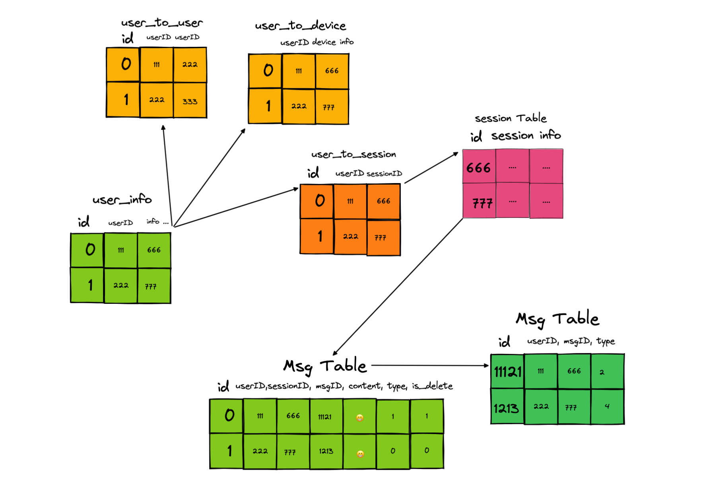

# IM server

**此md记录学习im相关的一些笔记**


确保 QOS2 + 时序性

- 可达性

- 准确性

- 时序性 消息按照时间顺序排列

关于字符流和字节流：

字符流可读 但是其效率不如字节流 传输的时候不需要转化

字节流在传输的时候需要进行序列化等操作 但是其传输效率高

小公司（几百QPS）一般使用的是字符流多

但是大规模项目一般使用字节流 且protobuf


### TCP & UDP

TCP面向**连接**协议，可分为长连接或短连接。

UDP面向**消息**协议，对于每一条信息都将创建一次UDP连接。

TCP在经过三次握手之后，确认连接的建立。再将信息发送出去。并在信息确认发送出去之后返回类似ACK的信息。表示信息成功传输

UDP的每一次连接都是对于信息而言的。每一条信息都是由发送方，发送出去就不管了。并且没有相比之下精密的握手等规定。

相比之下：

UDP在弱网环境下表现更优，由于特性决定了它的消息请求体相比之下会更小。而弱网的环境下，可以将UDP原有协议，进行一定程度上的包装和自定义。从而使他更加适合IM的使用环境。


IM中，数据通讯层无论用的是UDP还是TCP协议，都同样需要消息送达保证（即QoS）机制，原因在于IM的通信是A端-Server-B端的3方通信，而非传统C/S或B/S这种2方通信


## 架构设计

### 关于消息的一致性思考

> 设两人一对一聊天，发送方A依次发出了msg1、msg2、msg3三条消息给接收方B，这三条消息该怎么保证显示时序的一致性（发送与显示的顺序一致）？ 我们知道，发送方A依次发出的msg1、msg2、msg3三条消息，到底服务端后，再由服务端中转发出时，这个顺序由于多线程的网络的问题，是有可能乱序的。 
>
> 
>
> 会出现与发出时的消息时序不一致问题（收到的消息顺序是：msg3、msg1、msg2）。 不过，实际上一对一聊天的两个人，并不需要全局消息时序的一致（因为聊天只在两人的同一会话在发生），只需要对于同一个发送方A，发给B的消息时序一致就行了。 常见优化方案，在A往B发出的消息中，加上发送方A本地的一个绝对时序（比如本机时间戳），来表示接收方B的展现时序。 那么当接收方B收到消息后，即使极端情况下消息可能存在乱序到达，但因为这个乱序的时间差对于普通用户来说体感是很短的，在UI展现层按照消息中自带的绝对时序排个序后再显示，用户其实是没有太多感知的。

上述的问题描述的是在**点对点聊天中**，消息的显示顺序和发送顺序的一致性（发送的过程中会因**多线程or网络延迟**等多方面原因有可能导致消息的乱序）。

对此场景下，可以在每条聊天信息中都附加一个标记（时间戳）。并根据此时间戳重新排序信息。

但是在此之中也会存在几个问题，譬如说，排序本身的效率不是很高。如何定义一个合适的时间段（一个合适的窗口）。并将在此时间段内的如何排序呢？

`其实这里的操作机制非常类似保证TCP可靠传输的连续ARQ协议`

换句话来说，也就是。假设现在为了确保时序性，需要如上方解法采用一个MQ或其他容器来存储其中的信息。

- 但是如何规定这个容器的大小呢？ （一个容器一般情况下，最多存多少数据）

- 在消息间延迟低于什么值的时候，将值存到容器当中呢？（将延迟为多少的数据存入容器）

但是也许这些问题是根据IM实际使用场景所定义的，没有准确或否的答案。只有相关的优化方法。


> ### User
>
> 那么在这种情况下 是不是需要设计消息排序的时间段 规定一个进行排序的延迟范围 或是有其他更优的排序解法 并且当信息量很大的时候 这一个排序的时间成本也是很高的
>
> 
>
> ### ChatGPT
>
> 确实，当消息量增大或网络状况不稳定时，依靠时间戳进行消息排序可能会带来一些额外的挑战和考虑。以下是几种改进的方法和策略，以及如何处理大量消息时的排序效率问题：
>
> #### 设计消息排序的时间窗口
>
> 1. **定义时间窗口**：
>    - 可以设定一个时间窗口，允许在这个窗口期内接收的消息被缓存并排序。这个窗口可以是几秒钟，也可以根据网络延迟的实际情况进行调整。
>    - 时间窗口的目的是在不影响用户体验的前提下，给予系统足够的时间来接收和排序可能存在的乱序消息。
> 2. **动态调整**：
>    - 根据实际的网络状况和历史数据，动态调整时间窗口的大小。例如，如果检测到消息的平均延迟增加，可以相应地增加窗口大小。
>
> #### 排序算法优化
>
> - 高效的排序算法
>
>   - 对于大量的消息排序，可以使用更高效的排序算法，比如快速排序、归并排序等，这些算法在最坏的情况下也能提供较好的性能。
>- 在软件设计中，可以采用优先队列（例如使用二叉堆实现）来管理这些消息，优先队列可以高效地插入新消息并取出最早的消息。
> 
> #### 采用序列号而非时间戳
>
> - 序列号系统
>
>   - 另一个选择是使用一个增长的序列号而非时间戳。每发送一条消息，序列号增加。这样，即便两个系统的时钟不同步，消息的顺序也能被正确处理。
>- 这要求发送方在每次会话开始时同步序列号，确保消息的连贯性。
> 
>#### 实时同步和校正机制
> 
> - **时钟同步**：
>  - 如果继续使用时间戳，那么可以在客户端之间实施一种时钟同步机制，如NTP（网络时间协议），来减少时间差异带来的影响。
> - **消息确认和重发机制**：
>  - 设计一个机制来确认消息的接收状态，并在未确认的情况下进行消息重发。这不仅帮助保持消息顺序，还确保了消息的可靠传输。
> 
> #### 总结
> 
> 在设计这样的系统时，关键在于找到实现效率和用户体验之间的平衡。选择合适的时间窗口、优化排序算法、使用序列号和实施时间同步策略都是提高系统性能和用户满意度的有效方法。在实际应用中，可以根据特定的需求和条件选择最适合的策略。


### 全局时序性 & 单点时序性

全局时序性和单个群聊的时序性在概念和实际应用中有所不同。了解这两者的差异对于设计聊天系统尤为重要，特别是在考虑消息的一致性和用户体验时。

#### 全局时序性（Global Ordering）

全局时序性是指在一个系统中，所有消息都遵循一个统一的、全系统范围内的时序。这种时序保证了来自不同发送者的所有消息都按照一定的全局顺序被处理和接收。全局时序性常见于需要严格顺序处理的系统，比如金融交易系统，其中交易的顺序可能影响最终结果。

- **应用场景**：例如，一个大型的社交平台可能需要维护不同聊天群组之间消息的全局时序，以便于进行系统范围内的搜索、审核或其他全局操作。
- **挑战**：实现全局时序性通常要求复杂的时间同步机制和一致性协议，可能涉及较高的技术复杂度和资源消耗。

##### 单个群聊的时序性（Local Ordering）

单个群聊的时序性指的是在同一个聊天群组内，确保消息按发送顺序被所有成员看到的一致性。这种时序性只关注单一聊天环境中的消息顺序，不涉及跨群组或系统的消息顺序。

- **应用场景**：任何群聊系统，如WhatsApp、Telegram、企业内部通讯工具等。用户期望在同一个聊天群组内，无论是哪个成员发送的消息，都应该按照发送的顺序展现。
- **实现**：通常通过给每个消息加上时间戳或序列号来实现。只要群组内的成员接收和处理消息的机制一致，就可以保证群内消息的时序性。

##### 关键差异

- **范围与复杂性**：全局时序性需要在整个系统的层面上维护消息顺序，技术实现更为复杂；而单个群聊的时序性只关注局部环境，实现相对简单。
- **性能考虑**：全局时序性可能因为涉及更广泛的数据同步和一致性检查，对系统性能有较大影响；单个群聊的时序性对性能的影响较小，更容易优化。
- **用户体验**：从用户的角度看，群聊的时序性直接影响到他们的交流体验，而全局时序性通常是后台操作，用户不易察觉。


### 关于消息可用性 对上方一致性的具体实现方案

**消息可用性 = 可靠性 + 时序性**

#### 上行信息

为了保证信息的不重不漏，最基本的需要客户端发送信息到服务器之后，服务器返回一个ACK的信息。

但是如上所说，由于多线程的处理和网络延迟的因素，会带来很多不可预测的结果。

而为了在此环节中保证消息的完整性，最为重要的是**标志信息顺序的 唯一标识符** 

并且这个唯一标识符的设计，需要保证信息的**先后顺序**，并且性能需要足够高，保证消息处理的时间延迟足够低的基础上，尽量减少空间上的占用。

而 **服务器 & 客户端A** 的消息传递，可以分为sessionID和clientID。每一次长连接都可以认为是一次会话，以sessionID作为区分，而clientID则以单条消息为单位。

**（clientID的生命周期只存在与一条信息的上行or下行当中）**

在此可以分为三种方案：

> ### 方案一：严格递增的clientID
>
> #### 工作机制：
>
> 1. **连接建立**：客户端A与服务器建立连接，clientID初始化为0。
> 2. **clientID分配**：每次发送消息时，clientID严格递增。
> 3. **服务器验证**：服务器检查接收到的clientID是否为上一个preClientID加1。如果是，接受消息；如果不是，拒绝消息。
> 4. **消息确认**：服务器仅在成功接收消息后发送ACK确认给客户端A。
> 5. **客户端行为**：客户端A在收到服务器的ACK后，停止重发该消息；否则，可以重发消息，最多三次。
>
> #### 特点：
>
> - **顺序性强**：通过严格的递增确保了消息的顺序。
> - **重发机制**：有明确的重发策略，便于处理消息丢失的情况。
> - **简单性**：基于数字递增的机制相对简单和直观。
>
> 
>
> ### 方案二：使用时间戳的clientID链表
>
> #### 工作机制：
>
> 1. **clientID生成**：客户端A使用本地时间戳作为clientID。
> 2. **链表机制**：客户端在发送消息时，同时携带上一条消息的clientID。
> 3. **服务器验证**：服务器存储上一条消息的clientID作为preClientID，并将其与当前消息的preClientID进行比较。只有当它们匹配时，才接受消息。
> 4. **消息处理**：如果消息未按预期到达或preClientID不匹配，服务器拒绝该消息。
>
> #### 特点：
>
> - **基于时间的ID**：使用时间戳可以避免ID冲突，但可能面临时间同步的问题。
> - **链表依赖性**：消息的接收依赖于前一消息的ID，这可能在丢包较多的网络环境中导致连锁问题。
> - **复杂性**：需要处理更多的异常情况，如时间戳冲突和消息丢失的连锁反应。
> - **内存消耗**：当消息数量极大时，以时间戳作为clientID与preClientID会给服务器带来不小的压力。
>
> 
>
> ### 本质区别：
>
> - **ID生成方式**：方案一中ID严格递增，简单明了；方案二中使用时间戳，可能受到系统时间不同步的影响。
> - **容错性**：方案一通过重发机制处理消息丢失，方案二依赖于消息链的完整性，对单个消息丢失更敏感。
> - **实现复杂度**：方案二在实现上可能更复杂，需要处理时间戳相关的问题和更复杂的状态同步问题。


由于这种处理方式更使用于单个客户端和服务器之间的连接，并且其**确保消息合法性（时序性）**的条件更为严苛，所以在这一场景下，一旦网络等不可知因素出现波动。TCP出现超时重传的概率是大大增加的。这一情况会给服务器带来非常大的压力。

并且当某一次消息传达失败后。由于消息依赖的clientID与预期不符，不仅丢失的信息无法被处理，其后所以依赖该消息的消息也会被阻塞or拒绝，导致消息链断裂。


当因素干扰而导致消息乱序时，上方两种方案中信息均需重传。客户端重新发送信息、服务器验证消息时序性......等等等。可以想到如果能**暂时存储乱序发来的信息，并将其重排序，便可节省大量的成本**。

于是我们可以在此基础上推出方案三

> ### 方案三：在原基础上设计clientID list 
>
> 1.服务端针对每个连接存储多个clientID,形成clientID list 
>
> 2.使用此client List作为滑动窗口，来保证消息幂等
>
> 
>
> #### 滑动窗口机制的内存开销
>
> 1. **存储每个clientID**：每个连接需要服务器存储一系列clientID，这些ID标识了已接收和待接收的消息。这个列表或窗口随着每条新消息的接收而更新。
> 2. **时间戳作为clientID**：使用时间戳作为clientID时，通常需要更多的内存来存储（例如，使用64位来存储精确到微秒的时间戳）。此外，时间戳的范围和精度更高，可能导致列表存储更多的唯一值。
> 3. **滑动窗口的大小和管理**：窗口的大小（即可以存储多少个clientID）需要根据应用的具体需求和网络条件调整。较大的窗口可能提供更高的容错性和灵活性，但同时也需要更多的内存。
> 4. **高并发和高吞吐量环境**：在高并发连接和高消息吞吐量的环境中，服务器可能需要同时管理多个活跃连接的clientID list，这会进一步增加内存需求。

虽然效率有所提升，但是这种方案仍相当于是一种空间换时间的举措。需要考虑到内存开销相关的问题。

当然我们可以通过限制窗口大小，根据im的具体使用场景更改为更高效的数据结构等做法。


#### 消息转发

假设现在信息已经正常从客户端A发到服务器当中，并且已正确给客户端返回了ACK信息。称为消息正常地上行到服务器当中。


**如何准确判断不同客户端发送信息的先后顺序？**


此时我们需要考虑的问题是信息的顺序以及入库的问题。已知对于单个客户端来说，我们可以根据分配的**clientID**来判断消息的前后顺序。但是这个clientID只是对单个客户端而言的，仅仅保证了发送方的消息顺序，并不能保证整个会话的消息顺序。整个单聊or群聊的消息顺序仍需重新讨论。但是这一优先级其实并没有同一个客户消息的时序性优先级高。

为了保证消息的顺序性，我们需要重新定义一个**sqlID**，**代表在当前的会话环境中整体消息的顺序**。于是我们可以得到以下传递性的关系。

```
// 设两条信息clientID分别为cid1 cid2
if cid2 > cid1 :
	sid2 > sid1
// 并且此时若有来自其他客户端的信息时 ,sid2 - sid1 != cid2 - cid1
```

关于seqID还需要做一些额外的解释：

- 这个sqlID是针对某一特定会话的而非全局的，即针对特定的群聊or单聊。
- 若设定每一个不同的群组或小窗都有自身的**sessionID**，则在每一个sessionID下都有一组seqlID。

- 在上方所有条件的支持下，可以使用int64的数据类型代表seqID。

搞清楚了seqID，现在需要对他的存储以及分配作分析：

先从最简单的暴力解法开始考虑，此时seqID是面向全局而言的，无需重置。我们可以往redis中存储一个key，名为`msgincrby`，存储了当前最大的seqID。但是这一做法，所有群聊中的消息推送都会打在redis上，对redis的压力很大。非常不现实。

于是我们就优化出了已有的seqID的方案。每个会话session都分配不同的sqlID。此时存储的结构更加清晰并且压力更小。我们可以根据已有的sessionID与seqID进行拼接，如设置redis中的key为`msg:{sessionID}:seqID`其中sessionID使用特定群聊编号替换。并且此时的seqID也可以使用int64来进行存储。从特定的应用场景上进行分析，一个活跃的群聊，同一时刻信息推送的数量也是此时redis可接受的。

同时这一种组合Key的方法也便于使用哈希分片来进行**水平拓展**

> ### 哈希分片
>
> - **哈希函数**：系统对组合Key应用哈希函数，生成一个哈希值。哈希函数的设计需确保均匀分布，以避免某些节点比其他节点承担更多负载。
> - **分片逻辑**：根据哈希值，系统将消息定向到特定的节点或分片。这通常是通过取模操作实现的，例如，使用`hash(key) % N`，其中`N`是节点或分片的数量。
> - **水平扩展**：当系统需要扩展时，可以增加更多的节点或分片。消息可以根据其哈希值重新分配到新的节点，从而实现负载的重新平衡。
>
> ### 水平扩展的挑战与解决策略
>
> - **一致性哈希**：在传统的哈希分片中，添加或移除节点需要重新哈希所有的Key，这可能导致大规模的数据迁移。使用一致性哈希可以减少这种影响，因为它只影响到直接相邻的节点。
> - **数据迁移**：在节点增减时，确保数据迁移的过程中服务的高可用和数据的完整性是关键。这通常涉及到复杂的数据同步和故障转移机制。

综上，我们得出了一个较为合理的分配并且的方法。

然后，我们需要对消息的存储进行分析。结合sqlID的分配方法，我们可以得到在一个session中信息的唯一标识符。同样通过拼接两者，然后经过算法的处理，我们也可以得到一个唯一标识信息的msgID。接下来只需将此msgID异步交给MQ存入DB即可。


以上便是在正常运行的前提下，消息转发的运行逻辑。同时，我们也需要考虑失败的情况。

从运行的逻辑上来说：

1. 假如在根据sessionID分配seqID的时候，请求已失败或进程崩溃

> 消息此时未成功上传到服务器当中，不回复ACK信息，记为信息转发失败

2. 存储seqID的redis故障，如何处理？

> redis主从同步，主节点拉取从节点的值
>
> 但是拉取的过程和分配seqID是**异步**的过程
>
> 有可能在同步的时候，主节点的ID值已经更新，两个节点的值矛盾。
>
> 如果不进行处理的话。同一个seqID会分配给两个信息，此时造成消息的**回退**
>
> 对整个逻辑都会产生影响
>
> 
>
> 解决这个问题
>
> 我们可以在redis同时存储一个nodeID 代表是当前redis的节点编号 **（LUA）**
>
> 每次在拉取和分配的时候，将拉取的节点编号与存入的redis节点的编号进行比较。此处不赘述，为LUA脚本作用
>
> 如果比较的值存在矛盾，代表着此时出现了回退的问题，将此时的seqID值进行**跳跃（消息跳变）**，虽然对部分的资源进行了浪费（**消息漏洞**），但是保证了消息的可用性。
>
> 在客户端分析客户端下行信息的时候也需要考虑这一问题（**消息补漏**），下文介绍

3. 通过MQ写入历史记录的时候，MQ崩溃

> 结合1，我们可以再次调整回复ACK的时机，在成功存储消息之后才回复ACK。
>
> 但是此时seqID已经分配，会造成seqID的浪费。同样会造成**消息跳变**的问题，需要进行**消息补漏**


通过上方的对seqID的讨论，虽然经过优化，但是未免seqID仍不能做到**严格递增**，本质上是**趋势递增**


综上，整个消息转发的过程我们可以分为

1. 获得上行信息
2. 从redis中根据sessionID分配seqID，更新redis中seqID末值
3. 将信息的seqID和sessionID拼接，进行算法编码，发送给MQ，准备存入DB
4. MQ获得信息及ID，将其存入DB当中
5. 成功存入DB，返回ACK信息


**Q:但是，虽然这一做法保证了消息的可用性，但是每次写完DB再ACK，效率不会比较低吗？可以在MQ中进行备份等操作，从而保证信息能写入DB，而在分配好seqID发给MQ的时候就返回ACK吗？这样子效率应该更高。**


#### 下行消息

若信息在服务器转发成功。需要主动将信息发送到客户端B当中。

客户端B需要判断这一信息属于哪一个session并且是否符合消息顺序。在服务器信息转发的时候，我们尽量保证了信息的严格递增，但仍有部分的情况存在问题（一般只有在redis主从切换所产生的信息漏洞）。这一部分需要进行特殊的讨论。

于是在一般聊天情境下，我们可以采用类似上行消息中`preSeqID = seqID + 1`，保证信息的时序性。当遇到消息漏洞时，客户端主动向服务器pull拉取漏洞间的信息。

> eg：seqID由于redis主从切换从1跳到了10，所以服务器在发送seqID为1的信息下一条便是seqID为10的信息。此时客户端B主动拉取1-10间的信息，服务器补充空信息（此过程称为消息补漏）


同时在当客户端B突然需要向服务器请求大量信息的时候。可以结合两种除原方案外的解决方案：

1. 服务器告诉客户端B需要申请一次http的短链接，经过短链接传输数据的信息。
2. 采用TCP的拆包，将原有的信息拆成多个小包进行发送。


### 长连接网关设计


**回顾上方的消息可用性相关的分析，我们再次澄清一下。im的场景是一个三方通信，先由客户端A上行信息给服务器，服务器下行信息给客户端B。**


作为一个imserver，其收发信息频率极高。

在消息协议上，一般情况上以**TCP的长连接**为基础，弱网环境或极端情况下可在UDP等协议的基础上进行优化。

> **为什么选择TCP长连接？**
>
> TCP是面向连接而建立，在**收发频率高**的前提下。使用TCP短连接或其他方式，且不论安全性如何，会不断的重复建立并且删除连接。这一做法非常的影响效率，而TCP长连接在大多数情况下，只需要向连接的对方（Server / Client）发送心跳数据包，便可保持连接的活跃性。在传输信息的时候也可跨越复杂的步骤，提高消息的时序性。
>
> 但是使用这一方法，消息的**安全性**不可避免的会降低。需要通过其他措施进行保证。


但是TCP的长连接是脆弱的。连接及其所携带的信息都需要保证稳定性，当用户进入电梯（弱网环境），地铁（弱网＋切换基站）。在这一些情况下，连接都会断开并重建，长连接传输中的信息也会丢失，用户的体验也会被影响。

同时，业务需求的上线，也需要重启所有的长链接。就会导致其重新频率高，稳定性低。


**此处先根据信息的处理逻辑捋一遍。**

> #### 当客户端初始化建立长链接时
>
> 1. 向某个IP的长连接服务发送创建连接信令。
> 2. 网关server解析信令得知其为创建连接信令。
> 3. 网关server,获得底层socket的FD,以及用户的uid/did,建立注册表。
> 4. 回复客户端连接建立成功。
>
> #### 当客户端发送消息时
>
> 1. 客户端发送上行消息信令。
> 2. 网关服务接收到消息，并解析信令为上行消息信令。
> 3. 根据clientID和sessionID进行路由，分配seqID等状态更新逻辑。
> 4. 然后转发给业务层服务处理，确认业务层收到消息后立即回复客户端
> ACK.
>
> #### 当业务处理后，将消息转发给接收客户端时
>
> 1. 业务根据sessionID定位到该会话的接收者的连接在哪一个网关服务上。
> 2. 然后将消息通过RPC交给网关服务，网关拿到数据后通过uid对应connID,确定fd.
> 3. 然后根据fd找到对应的socket,将消息拼接固定消息头发送给接收方客户端。
>
> #### 当连接断开的时候
>
> 1. 心跳超时，连接断开/异常断开
> 2. 状态回收释放

如下图


上方是根据消息的处理逻辑所作出的基本图示.

但是从细节上进行考虑,我们需要考虑:


#### 信息监听及推送

为了达成监听和推送的目的,我们可以先得出如下方的一个暴力解,每一轮的收发消息需要用到三个协程,分别为**监听**,**推送**,**判断消息可达或否**


在此基础上,我们可以使用**go-select**语句进行轮询.并且将协程**池化**.

前者节省了协程的部分开销；后者减少了调度开销(创建和删除协程)

但是无论如何设计，若使用`go协程 + 轮询`的模式仍会存在很大一部分的成本

有没有办法可以将其修改为事件驱动呢？


可以通过修改为`reactor模型+epoll`的模式，将收发信息完全事件化。不再会因为协程堵塞产生开销。配合池化思想：

- 当epoll发出读请求时，从协程池中取信息转发

- 当逻辑处理完毕下行消息，从协程池中取协程push信息。

架构如下：


在了解了如何将信息的时空成本控制在最小的程度下，我们还需要考虑长连接中，如何存储长连接的状态。


##### IO多路复用相关

此处补充与epoll,select相关IO多路复用的内容

在高并发的情况下，如何应对多个客户端的连接以及信息的传递？

首先思路可能会是**多线程**，但是当并发量非常大的时候，多线程所带来**CPU上下文切换**的影响是非常严重的。

于是转换思路——以单线程为基础

若当线程A与服务器正在传输的时候，线程B也发送消息到服务器当中，那么此时的信息会被**DMA控制器**复制到服务器的内存当中。


**select**

主要使用流程：

1. 创建socket且listen
2. 遍历**文件描述符(FD)**，寻找其最大值（便于之后语句进行遍历）
3. 循环监听FD，创建新位图`bitmap`，用于标记含有数据FD（**FD_ZERO**）。
4. 循环检查FD中是否有数据，若有数据，在`&rset`中进行标记（**FD_SET**）
5. **将数据从用户态拷贝至内存态（调用select）**，再次遍历，判断FD中是否含有数据（**FD_ISSET**），并依据FD中数据的类型（READ WRITE等），对数据进行操作（打入缓冲区等等等等）


在分析之后 可以很明显发现select模式具有一些问题

- **bitmap大小**：select中使用bitmap来标记含有数据的FD，但其大小上限仅为1024
- **rset不可重用**：若select中含有数据，则在内核态中会修改rset的值（置位——第4步的值）
- **用户态和内核态之间的开销**：依据流程可知，在select这一步中需将数据遍历并复制到内核态中，会造成一定的时间开销。但是！一般的数据操作也是用户态需要向内核态申请操作的，所以本质上是节省时间的，这也是select函数较高效的一个重要原因
- **遍历耗费时间：**由`while(1)`进行循环监听开始，置位等操作直至select执行完毕，遍历FD执行操作。需要进行三次时间复杂度为`O(n)`的遍历，这也是select不适配大数据量情况的重要原因。


**poll**

poll的大致使用过程跟select是一样的，其实现原理也大致一样，此处仅对比介绍不同点

- select 使用bitmap进行存储
- poll 中定义结构体**pollfd**，并使用此结构体数组存储 结构体定义如下

```c
struct pollfd(){
	int fd; // 文件描述符标号
	short events; // 标记数据需要进行的操作 read write等
	short revents; // 标记数据是否需要进行操作
};
```

**这么做相比之下解决了select的什么问题？**

不再区分bitmap和rset，取而代之的**pollfds**可进行**存储 & 置位**操作。对于FD的存储空间，上限即为数组容量上限（远大于select中的bitmap1024字节）。在每一次while循环中，poll模式无需重置类似rset数组（pollfds可重用）。只需重置对应的字段值（**revents**）就可以了。


**epoll**

`epoll`类似于`poll`，使用一个文件描述符（epfd）来存储监视的文件描述符及其对应的事件，但不同于`select`中的`rset`数组和`poll`中的`revents`字段。

其所进行的优化如下：

1. 在`select`和`poll`中，都需要将数据由**用户态拷贝到内核态**。而`epoll`通过内存映射的方式（`mmap`），将内核空间的事件表与用户空间共享，从而不需要进行频繁的数据拷贝，大大降低了内存开销。
2. 在遍历`epfd`的时候，若监听到有文件描述符（fd）需要执行操作，会将此数据放入就绪队列（event list）。并且记录需要执行操作的文件描述符的数量**nfds**。
3. 在传统的`select`和`poll`中，需要遍历所有文件描述符进行`O(n)`时间复杂度的检查和操作。而在`epoll`中，调用`epoll_wait`时，直接返回就绪的文件描述符和事件列表，仅遍历nfds次（上方所记录的需要执行操作的文件描述符总数），执行操作。这样时间复杂度由`O(n)`降为`O(1)`。


###### 关于epoll 详细的工作流程

> ### 1. 创建`epoll`实例
>
> 创建`epoll`实例，返回一个文件描述符`epfd`。这个文件描述符用于后续所有与`epoll`相关的操作。
>
> ```c
> int epfd = epoll_create1(0);
> if (epfd == -1) {
>     perror("epoll_create1");
>     exit(EXIT_FAILURE);
> }
> ```
>
> ### 2. 添加文件描述符到`epoll`实例
>
> 通过`epoll_ctl`函数将要监视的文件描述符添加到`epoll`实例中。每个文件描述符关联一个事件结构`struct epoll_event`，包含感兴趣的事件类型（如`EPOLLIN`表示可读事件）和用户数据。
>
> ```c
> struct epoll_event ev;
> ev.events = EPOLLIN;  // 监听可读事件
> ev.data.fd = listen_sock;
> if (epoll_ctl(epfd, EPOLL_CTL_ADD, listen_sock, &ev) == -1) {
>     perror("epoll_ctl: listen_sock");
>     exit(EXIT_FAILURE);
> }
> ```
>
> ### 内部机制：内核事件表和就绪队列
>
> #### 内核事件表
>
> - **数据结构**：内核为`epoll`实例维护一个高效的数据结构（如红黑树或哈希表），用于存储所有被监视的文件描述符及其事件。
> - **作用**：当我们使用`epoll_ctl`添加或删除文件描述符时，内核会在这个事件表中进行相应的增删改操作。
>
> #### 就绪队列
>
> - **数据结构**：内核为`epoll`实例维护一个就绪队列，用于存储那些已经发生事件的文件描述符。
> - **作用**：当某个文件描述符上有事件发生时，内核会将这个事件添加到就绪队列中。
>
> ### 3. 等待事件发生
>
> 通过`epoll_wait`函数等待事件发生。这个函数会阻塞，直到有事件发生或超时。
>
> ```c
> struct epoll_event events[MAX_EVENTS];
> int nfds = epoll_wait(epfd, events, MAX_EVENTS, -1);
> if (nfds == -1) {
>     perror("epoll_wait");
>     exit(EXIT_FAILURE);
> }
> ```
>
> #### 内部机制：`epoll_wait`的执行过程
>
> 1. **检查就绪队列**：
>    - `epoll_wait`首先检查就绪队列。如果就绪队列中已有事件，直接将这些事件返回给用户空间。
> 2. **挂起进程**：
>    - 如果就绪队列为空，内核会将调用`epoll_wait`的进程挂起，直到有新的事件发生或超时。
> 3. **事件发生**：
>    - 当被监视的文件描述符上有事件发生时，内核会将这些事件从内核事件表中移到就绪队列。
> 4. **唤醒进程**：
>    - 将挂起的进程唤醒，将就绪队列中的事件拷贝到用户提供的缓冲区，并返回就绪事件的数量。
>
> ### 4. 处理就绪事件
>
> `epoll_wait`返回后，遍历就绪事件，并根据事件类型进行相应的处理。
>
> ```c
> for (int n = 0; n < nfds; ++n) {
>     if (events[n].data.fd == listen_sock) {
>         // 处理新的连接
>         int conn_sock = accept(listen_sock, NULL, NULL);
>         if (conn_sock == -1) {
>             perror("accept");
>             exit(EXIT_FAILURE);
>         }
>         ev.events = EPOLLIN | EPOLLET;
>         ev.data.fd = conn_sock;
>         if (epoll_ctl(epfd, EPOLL_CTL_ADD, conn_sock, &ev) == -1) {
>             perror("epoll_ctl: conn_sock");
>             exit(EXIT_FAILURE);
>         }
>     } else {
>         // 处理现有连接上的数据
>         char buffer[1024];
>         int bytes = read(events[n].data.fd, buffer, sizeof(buffer));
>         if (bytes <= 0) {
>             // 关闭连接
>             close(events[n].data.fd);
>         } else {
>             // 回显数据
>             write(events[n].data.fd, buffer, bytes);
>         }
>     }
> }
> ```
>
> #### 处理新的连接
>
> - 当监听套接字（`listen_sock`）上有可读事件发生时，表示有新的连接请求。
> - 调用`accept`接受新连接，并将新连接的文件描述符添加到`epoll`实例中。
>
> #### 处理现有连接的数据
>
> - 当其他文件描述符上有可读事件发生时，表示有数据可读。
> - 调用`read`读取数据，如果读取到的数据长度为0或负数，表示连接关闭或出错，关闭该文件描述符并从`epoll`实例中移除；否则，处理读取到的数据（如回显数据）。


#### 信息状态存储

了解如何存储状态的信息，我们需要先捋清楚有什么状态信息需要存储

- uid/did/fd 用户标识符，设备标识符，存储的文件描述符
- sessionID / connID 通讯场景标识符，连接信息
- seqID / clientID 信息时序性标识符
- connID 对应的 conn对象 **定时器存储已达or未达信息（定时器）**

**优化方式:**

- 此处定时器的作用在于判断信息是否到达，若信息到达并返回ack则代表成功到达。未到达则需要重发。在满足这一要求的情况下，我们可以使用时间轮算法，将其区间化，在某一段时间（单位为ms）内，仍未收到ack信息的消息全部重发。这一算法在某种程度上也节约了push信息时所耗费的资源.**(true?)**


- 维护uid/did到connect对象所在机器endpoint倒排:

  > 建立一个反向索引表，将用户ID(uid)和设备ID(did)与连接对象所在的终端设备IP地址加端口号建立对应关系。也就是说，可以根据uid/did查找到对应的连接对象所在的机器的网络地址(endpoint)。业务层server调用网关服务的时候，需要通过uid等信息，进行反查查询该用户目前在哪台网关服务器上


- 判断消息可达或否的**飞行队列**使用redis-list存储，进一步减少内存消耗。


上方在经过存储结构和协程的优化后，在单体架构上已经接近瓶颈。但是我们可以将他拆分为微服务。将其分为两个模块。分别是`gateway`和`state server`。拆分架构如下：


1. 网关serverf仅维护connID到fd的map映射
2. connect对象中定时器，飞行队列等状态交给完全独立的state server维护，与网关server之间通过RPC进行通信
3. 业务层将消息发送给state server由其控制收发逻辑

就相当于把有状态服务全部丢给state server进行存储和维护。而gateway层只负责收发。这么做虽然会因为rpc调用产生部分的时间成本。但是将有状态服务都从网关层隔离出来，减少它的业务的耦合度，提高它的可靠性。


### 领域驱动设计 DDD

**domain driver design**

#### 基本概念

- 领域专家：产品&运营&顾问，对该业务领域具有深刻认识的人，掌握足够的领域知识的人。
- 统一语言：领域专家和开发团队等等角色之间对关键概念建立统一的定义，消除沟通歧义。
- 界限上下文：界限是一种判断标准，上下文强调的是对知识的隐藏，可以把微服务等价于界限上下文，一个界限上下文划分出一个自治单元，具有最小完备，自我屋行，独立进化，稳定空间四个特点，因此界限上下文对应着一个套微服务，也对应一个技术团队。
- UP(U)上游：特指被调用者，提供能力的被依赖方。
- Dow(D)下游：特指调用者，使用上游能力解决问题的角色.
- 上下文映射：表示上下文之间的依赖关系，也反映了团队直接的协作关系。
- 实体：具有唯一标示符的对象。
- 值对象：不具有唯一标示符需要依赖实体存在的对象。
- 聚合：持有一些相互强协同的实体之间的引用，通过标识符引用实体。
- 聚合根：唯一能被对外引用的句柄，任何外部访问聚合内的实体，都需要通过聚合根对象，其他聚合也仅能通过聚合根引用其他聚合。
- 工厂：就是工厂模式，用来创建并管理复杂聚合的创建与销毁。
- 资源库：负责统一管理一个聚合的增删改查行为以及状态的变更，工厂和资源库实现对聚合对象生命周期的管理。
- 领域服务：业务功能需要多个聚合之间相互协作才能完成，在聚合之上需要一个服务来封装聚合之间的协作行为。
- 应用服务：领域服务关注整体业务的横向能力建设，应用服务关注的是对横向领域服务的协调与驱动，为完成某个业务功能，协调领域服务最终交付：
- 基础设施：所有的技术实现细节都被隐藏在基础设施中
- 领域事件：主义+定语，所描述的在领域内的客观事实，公式：产生事件的对象名称+完成的动作的过去式
- 角色命令：由某种角色，触发了某种命令，发生了某种领域事件。
- 问题空间（域）：业务领域中的客观事实以及期望目标的统称。
- 解系统（空间）：解决问题的技术实现。
- 分层架构：用户界面层，应用层，领域层，基础设施层。


ddd更适用于业务较为复杂的系统，尤其是分布式系统当中。以上图的流程，我们可以将一个业务垂直拆分为多个环节。

对于某个业务，需要寻找出其中所蕴含的运行逻辑，缕清业务的运行流程。拆分为多个实体，寻找实体间的因果关系，归纳出所谓的子问题。

对于子问题，图中分为三种**核心/支撑/通用**。这里可以以IM中c2c场景为例：

- 核心域：发送&接受信息 —— 业务的核心，项目的核心竞争力所在
- 支撑域：第三方库MQ等 基础设施一类 优先级并不高
- 通用域：中台代码 可横向复用的代码


以上

ddd中还有很多的概念 ，但是个人感觉没有必要一下子将其全部记住（没有实践也非常难以吸收）

此处推荐美团的一篇文章，其中以**抽奖系统**为例子，非常清晰得介绍了使用ddd的开发流程(java)

[领域驱动设计在互联网业务开发中的实践](https://tech.meituan.com/2017/12/22/ddd-in-practice.html)


#### IM 系统中的实践

##### 整体架构

（暴力解）

im中依据此思想可将原问题分治为：


通过DDD中的思想，我们可以把问题分割为`领域层、应用层、基础设施层`。

如上图的思想，可以初步将系统分为**用户**，**消息**，**会话**三个领域。三者也均为对应领域中的**聚合根**。而相对应的信息，关系链等信息则为对应领域下绑定的值对象。

- 用户服务 user-server，管理用户信息与之对应的权限。
- 关系（会话）服务 relation-server，管理用户关系链及其信息。（可以是用户参与的会话，用户的好友，用户设备信息did等）

- 消息服务 message-server，管理消息维度的上信息。

将上述三个领域内服务抽象出对应的API，暴露应用服务层作为`API Server`

在这一基础上抽象一个基础设施层次support or common，封装所有的基础设施（MQ DB etc）

---

##### 业务

上方是整个系统在架构上的选型，现在在业务层次，程序实际运行流程的角度上讨论。有关上下行消息等技术细节在上方已讨论过的，不再赘述。

**单聊**

A端-Server-B端，据消息流程分为上下行消息：

1. 上行消息，api-server调用msg-server，对消息异步存储。（MQ对消息进行传输）

2. 下行消息，api-server根据消息中目的客户端字段确定发送对象，调用user-server获取发送对象消息(包括发送对象的did等信息)，将消息打包为下行消息发送给接入层

**群聊**

群聊单聊本质上是一样的，上下行消息的处理流程也基本一样。唯一不一样是在获取发送对象信息时，调用relation-server，查询当前session下除了自身以外的所有did,(设备Id以会话为id存储)。将选择好发送对象的信息逐条打包下行。

**多设备登录/同步**

接入层将新设备登录的状态信息同步到api-server中，将其userID和did的映射关系重新注册到关系链服务当中。（接入层会维护一个**用户信息与登录设备信息的表**）

显然，一个用户若在多端进行登录，其维护的did就会有多个，而在会话中，单聊和群聊的下行信息量就会成倍增大。这也是为什么很多情况下，IM软件会限制登陆设备的数量限制。

**在线状态（状态广播）**

同理，接入层在某个用户上线时，将新状态同步到api-server当中。

api-server通过relation-server的服务找到此用户的好友信息，推送自身的登录状态。

**多媒体信息**

可配置一个类似云盘的服务。在客户端上传的时候，将此文件上传到系统提供的**云存储**服务，将返回的存储表示存储到im当中。

需定义一套映射不同的云存储id与多媒体消息类型的规则

**消息漫游 拉取历史 离线推送**

1. 客户端通过独立的http短链接拉取消息会话的历史消息（有什么优势来着 忘记了）

2. 仅拉取最新的一部分信息，记录拉取信息中的seqID，通过seqID计算，显示离线期间还有多少记录未识别（seqID说保证单session内消息时序性），如果用户需要则再次进行消息的部分拉取。

**消息撤回（拉取回执）**

本质上和发送消息的上行 & 下行流程是一样的，只是在推送消息的时候，会给对应的消息打上撤回的信令。

**已读/未读**

客户端上报可读事件，可通过http接口上报减轻长连接网关带宽。将用户的读取状态push给当前会话内的其他人。

**添加好友/会话列表/好友列表等**

api-server操作relation-server增加好友，注意，无论是单聊还是群聊，都是以session为单位的。所以会在两者第一次聊天的时候创建对应的session

客户端启动的时候，会在relation-server中拉取会话列表


综上，一个可行的暴力解就出来了

但是在其中仍有很多热点问题，例如说当大规模群聊且多端登录发送消息时，很容易造成消息风暴（下行消息太多了）。于是可以使用**session绑定**的方法在大群聊大中加以优化。

而relation-server交互的次数太多了，其中包含的数据也比较冗杂。可以在架构上再度将其拆解为 **会话/关系** 两个层次。将其变为session-server。而对用户信息的查询和用户关系的查询通常一起出现，没必要分成两个服务，因此可以将其合并在一起。重新定义user server的职责，负责查询用户信息，用户关系，以及用户与设备的关系。

初次之外的问题，即可行优化还有：

- 在线状态从推改为拉，由客户端在展现某个好友信息时，异步去服务端

- 查询在线状态多媒体存储成本高，可以通过上传时计算其hash值，使用hash值进行消重复，如果多媒体内容重复则在底层存储中**仅存储一份数据**，减少存储的成本（相同数据减少备份存储）
- 历史消息可以分级存储，**冷热数据分离**，用户活跃度分级等方案，这里也存在读写放大问题，会在存储层讨论。
- 设计M时必须具有读写放大的思维视角，消息撤回同样存在读写放大问题，设计决策会还是会在存储层讨论，关于大群聊问题，依旧可以通过上述的**session绑定**的方式解决。
- 已读事件与在线状态一样，对于大群聊可以直接退化为**拉取模式**，当用户停留在消息窗口内再去务端拉取已读列表即可


### 缓存

非常简单暴力的概括一下IM中表拆分的业务需求，无非就是：

- 三关系表：user_to_user \ user_to_device \ user_to_session
- 单消息表（每条消息所具有的信息）：msg(userID,sessionID,msgId,seqId,content,type,is_delete)
- 单消息状态表：msg_state(userID,msgId,type)


1. 对于关系表：

- 用户 & 用户：两用户间好友or黑名单等关系

- 用户 & 设备：在此IM上，同一用户在any设备上登录。记录用户的登录设备信息。用于下发信息 & 消息漫游等业务
- 用户 & 会话：用户是某个群聊 or 私聊的成员


2. 消息表：记录每条信息的 发出者，发出群聊，消息的唯一标识符，序列号（保证单群聊内信息的时序性），具体内容，信令类型（正常信息 or 撤回等），是否撤回。


3. 消息状态表：记录每个用户对某消息是否已读等

> 注意：消息状态并非是消息本身的属性。此处状态是针对每个用户而言。譬如说A信息可能B用户已读，但是C用户未读。此时在消息状态表中存储的状态就是不一样的




综上表，我们设计出了一个应对IM中信息收发业务的表架构雏形。但是在规模较大的情况下完全不可行的，需引入**缓存**及其他优化措施。

在实际开发的运用可大致列举为以下缓存策略：

1. 旁路：写时：更新DB,删除cache;读时miss后查DB回写cache**高一致性**
2. 穿透：写时：缓存集中则更新DB和cache,miss仅更新DB;读时：miss则查询DB并回写 **冷热分区**
3. 异步：写时：只更新cache,异步更新DB,读时：miss后查询DB并回写 **高频写**
4. 兜底：写时：直接写DB,读时：读DB失败后读cache/成功后回写cache **准确性**
5. 只读：写时：更新DB,读时，读cache,其他异步方式更新cache **100%命中率场景，最终一致场景**
6. 回源：写时：写DB,读时：读DB **缓存的降级时期**。

| 缓存策略     | 操作 | 命中 | 更新数据库 | 更新缓存     | 特点           |
| ------------ | ---- | ---- | ---------- | ------------ | -------------- |
| **旁路缓存** | 写   | -    | 是         | 否           | 高一致性       |
|              | 读   | 否   | 是         | 是           |                |
| **穿透缓存** | 写   | 是   | 是         | 是           | 冷热分区       |
|              | 写   | 否   | 是         | 否           |                |
|              | 读   | 否   | 是         | 是           |                |
| **异步缓存** | 写   | -    | 否         | 是           | 高频写         |
|              | 读   | 否   | 是         | 是           |                |
| **兜底缓存** | 写   | -    | 是         | 否           | 准确性 高可用  |
|              | 读   | 否   | 否         | 是（失败时） |                |
| **只读缓存** | 写   | -    | 是         | 否           | 最终一致       |
|              | 读   | 否   | 否         | 是（异步）   |                |
| **回源缓存** | 写   | -    | 是         | 否           | 缓存的降级时期 |
|              | 读   | 否   | 是         | 否           |                |


注：下方设备与客户端同义

##### 离线后上线同步消息 （**穿透 & 旁路模式**）

在用户下线之后，原下发消息会不断挤压。等待用户再次登录的时候拉取。此处使用redis中的zset进行存储，以sessionID为key。不同的会话内，以消息的序列号（seqID）为score，msgID为value。存储离线消息信息。

当用户该设备再次上线时，从redis中对应sessionID拉取对应的msgID的list，将其返回。

在允许多设备登录的情况下，某条信息可能已经下发到A设备中并且被用户已读了。但是由于B设备未登录，B设备对此消息的状态是未知的，会默认拉取离线队列，并且再次将其标为未读。造成了**消息状态不一致**的问题。为解决这一问题，只需要在取出msgID-list时，查询消息状态表即可。

但是此举会大大降低拉取的效率。也许可以在缓存层再设计消息状态的分布式缓存？但这种做法同样需要维护**消息状态缓存的一致性**。

一种好的方法是利用**旁路**缓存思想。在消息的状态发生变更的时候，直接将缓存删除。而当消息状态查询请求到来时，**先查缓存，miss则查DB且回写缓存，hit则返回缓存**。这一策略牺牲了一定的查询效率，但是**尽最大努力保证DB层和cache层消息状态的一致性**。

同时，随时间增大，zset中的缓存数据并不会收敛，会一直挤压离线消息。此操作本身会对存储空间造成一定的压力。可对其进行定期清理，或实现多设备间消息同步，但也同时会对客户端上压力😂。所以需根据IM的具体业务场景，商讨其中的存储实现细节。


##### 映射关系存储于内存中（只读缓存）

在上述表关系中，**用户 & 会话 & 设备**之间的映射关系是一大重点。映射关系决定了信息的下发对象，是IM运行的根本。并且他的修改请求频率较少（用户加入群聊，新设备登录，添加好友的频率 对比 发送消息的频率）。

但是同时，对这类映射关系的读需求很大。每当一条信息下发，服务器需要根据sessionID找到含有的userID，再根据userID找到各用户的deviceID。在这每一步的查询中若miss造成了缓存击穿，影响非常严重。

综上，可以得出此板块**读多写少**。于是我们可以全盘维护一个映射关系的缓存。同时基于flink等大数据组件，实现数据的流式更新。但是这也会对存储空间造成很大的压力。当然，可以改变架构使用图数据库存储，或改为**session绑定**，但需同时修改接入层的架构。


上方的设计理论上对消息下发进行大量的优化，但只是针对于一般情况下的运行作分析，仍存在很多问题。下方分为**极端情况 & 异常状况**进行分析：

> 先回顾一下信息下发的真实流程：假设有`k`个群聊，每个群聊中有`n`名用户，每个用户具有`m`台设备。那么在所有设备在线的情况下，一条上行消息对应发送`(n * m) - 1`条下行消息（除去发送方）。`k`个群聊单条消息对应`k * ((n * m) - 1)`条下行消息，这一数量级是非常恐怖的。

(渣图如下)


##### 极端情况

1. 若IM产品的设计需求人数限制大（千人级，万人级）。那么在此架构下，单sessionID对应的userID非常庞大，是发散的。随着消息的发送，不可避免的会造成**大Key**问题。
2. 上点围绕用户多的情况展开分析。但若群聊非常活跃，即使用户个数非极端，也会造成很大压力。与**大Key不同**，会产生**热Key**。前者指存储空间上的不收敛，占用空间资源大；后者指对key的查询等请求非常频繁，占用缓存引擎（如redis）资源大。
3. 若采用上方所说的**旁路**解决消息状态一致性问题，每当某个消息被单用户查看（消息状态改变）时，都会删除缓存。假设，多个用户在短时间内同时查看同一未读消息（短时间内多人更新同一消息状态）。会造成缓存频繁删除，多个查询消息的状态请求直接打在DB上，经典**缓存击穿**。
4. 无论是大Key还是热Key还是普通Key，在现阶段机制下。当消息下发，必须经由`userID -> sessionID -> deviceID`的路线。成为性能瓶颈。

...


##### **异常状况**

假设缓存引擎清一色为redis

1. 大量依赖redis，运行过程中对redis访问频率非常高。在资源上，高频率的访问难免会**占用相当一部分的系统资源**。从而影响到了核心服务，核心逻辑的运行。在空间上，对**内存的使用**存在巨大成本。在安全上，不严格的忽略副本等机制，假如redis崩了，全崩了。
2. 在用户拉取离线消息的时候，会造成大量的缓存更新（消息状态缓存  & zset离线消息队列），其中涉及redis和DB。如果这时候**拉取**这一业务本身出错，由于两个数据库本身异构，会造成信息存储的不一致。

...


##### 大Key 问题

**大Key问题**指的是在使用缓存或存储系统（如Redis）时，单个Key对应的Value非常大，导致一系列性能和稳定性问题。主要包括：占用大量内存资源，网络传输需要较长时间与带宽，迁移困难等等。


大Key的评估标准：

- String类型value长度超过10KB
- 集合类型元素个数不超过5000个
- 集合类型单元素总长度不超过10MB


若抛开业务上的优化空间，业界对于此问题的解决方案为**拆分Key**，**压缩Key**，或结合**持久性KV**

1. **拆分Key**：将原单Key根据大小均衡分片至多个Key中。可在原Key的基础上加入分片的序列号，在获取值时，使用mGet一并获取所有分片的值即可。（mGet同时获取多个键的值 并同时返回）

eg:`user1 -> user1.1 + user1.2 + user1.3`

2. **压缩Key**：将原Key在存储前，使用压缩算法减少Value的大小，并且在读取时进行解压。会降低**存取效率**，并且对**服务器CPU造成一定压力**

3. **持久性KV**：使用CoreKV等持久性NoSql替换现有架构，大大提升大Key的基准值。但是会**降低读取效率**

而在业务层面上，针对IM的场景，可使用**session绑定**机制进行优化：

按照此前架构，当用户发送消息时，会经由`userID -> sessionID -> deviceID`的路线查询下发设备。所有登录设备信息和用户信息都在作为**分布式缓存**存储在业务server中，并在其中执行所有的查询。

而session绑定如果不严谨的类比，其实类似是**打表**的思想。在用户登录（设备上线）时，通知业务server**登录状态发生改变**。

同时业务层将该用户相关(userID)的会话(sessionID)信息，即群聊成员设备信息(did) 存储到各网关机的本地内存当中。这么说可能有点绕，下方分点阐述优化前后的工作流程：

（忽略错误情况）

前：

1. 用户登录，设备上线。
2. 用户发送上行消息，业务server无误收到，并准备消息下发。
3. 在业务server中的分布式缓存中根据sessionID查询到userID，根据userID查询到deviceID，明确下发对象。
4. 明确发送的deviceID后，消息下发。


(原架构示意图)


后：

1. 用户登录，设备上线，通知业务server。
2. 业务server将此用户所进入的会话sessionID及其设备信息deviceID先计算出来
3. 业务server将相关设备信息存入**指定网关机**的本地内存当中（网关机的选择可以根据用户的地理位置或吞吐能力等因素进行选择）
4. 用户发送上行消息
5. 业务server无误收到，携带sessionID来到**指定网关机**当中
6. 各网关机根据本地内存中**session和device**的映射关系，下发消息


（后架构示意图）


本质上，其实就是将原在业务server中查询缓存，分发到了各网关机当中（此处的冗余存储也许还可以优化？）。但是当用户量巨大时，造成的空间压力还是很大的。并且按照上方的设计，是就将登录用户的所有会话都存储入网关机当中。假如用户**不发言**，或某些群聊的**活跃程度相当低**，就白白浪费了这多份内存。

所以其实根据IM的设计用途，这里也需要具体问题具体分析。一种可行的解法是，将网关机存储这一过程（第**3**步）的执行时机修改为：**用户进入指定会话时**。这一修改，理论上**有几率会降低用户首次进入不同会话后首条信息**（后面会说明）的发送体验。但是对各网关机的空间存储都是一个优化。还是再说一下第二回修改后的工作流程吧：

1. 用户登录，设备上线，通知业务server。
2. 用户进入会话 or 发送上行消息 （进入会话本身和发送信息是两个独立的过程，并且发送信息必须在进入会话后）

3. 业务server记录当前session，查询出该session所对应的所有deviceID（这里的查询还是要` sessionId -> userId -> deviceId`）
4. 将session和device的映射关系发送到指定网关机
5. ....... , 根据关系下发信息。


注意，网关机本地内存存储的是同个session内所有的device的信息。也许你已经想到了，就是同个session内不同的用户，可以设法**复用这一份本地内存**。譬如说，可以是 成功在网关机中存储之后，返回回执，并且在业务server本地记录**缓存**，表示各网关机内，有哪几个session的相关信息，其实就是一个**从业务server下发至网关机的路由表**。这也是为什么**有几率降低用户首次发信息的体验**，即下方第二种情况：

- 业务server指定表中，某个网关机存在指定session中device信息，**路由到对应网关机**并进行信息下发，无需进行其他操作。
- 业务server指定表中，没有任何网关机有指定session的device信息。此时**请求业务server查询映射关系**，**记录到网关机后**。进行**信息下发**。

（再次修改后的流程图 无device信息时的查询下发流程）


当然，多了一份本地内存，也多了一个需要维护一致性的对象😢。需要维护**网关机本地内存与业务server中映射关系的一致性**。可参考上文旁路模式相关的缓存策略。

这一方法本质上增加了网关机中的空间压力，但是解决了大Key带来的难处。但是整个运行的流程更加复杂。


##### 热Key 问题

**大Key**主要在于数据量大，而**热Key**主要在于访问量大，远远高于其他Key，从而造成性能瓶颈或系统不稳定。这种情况在分布式系统中尤为明显，可能导致某些节点过载，影响整体性能。

对热Key的处理可以分为 **降频 & 止损**：

###### 降频

想方设法降低请求打在目标单Key的频率

- **备份存储副本**：注意，**副本 ≠ 分片**，指对热Key相同的内容存多几份。在读取的时候，根据负载均衡随机读。但是在更新的时候，需要同时更新多个副本，所以比较适用于**读多写少**缓存。刚好适配了IM中对映射关系的存储（有关映射关系的讨论见上一文）。


- **本地LRU / LFU缓存热Key**：上方在讨论大Key已经涉及到了网关机的本地缓存了。此处指的是将热Key数据存储在业务server内存中，可以是一个HashMap等数据结构；与分布式缓存相比，它可存储空间更少，但是存取效率更高。但是也面临同样的**一致性问题**。上一文所讨论到的**活跃群聊**场景适合使用，但是必须需经过测试，评估出在保证一致性的环境下，更新的最优时限。（CAP）


- **业务上拆分Key**：这才是分片，通过将热Key中存储数据根据业务，进行进一步的解耦，拆分为多个Key，即可分担原热Key的压力。这种模式其实很适合搭配**旁路缓存**，在保证**降温Key同时也保证了高一致性**。


###### 止损

热Key大量的访问非常影响资源分配，非常影响服务器的运行。所以在无法优化的情况下。我们也需要设置一些兜底的方案。这些方案相比之下更具普遍性（只能算是个方向而非具体方案）。

- **对热Key限流**：人为限制key的访问量
- **手动禁用 & 兜底策略**：当热Key影响非常严重时，切换该服务的planB（如果有的话）


上述主要围绕session绑定，在业务上改善了大Key的问题。但是不分青红皂白的对全部会话情景（单聊 ，小群聊 & 非活跃群聊，大群聊 & 活跃群聊）使用session绑定。部分情况下还是比较浪费带宽等资源。并且，目前的架构本质上还是存在很严重的**读放大**问题。注意，这个问题是存储架构决定的。本质上不能解决，只能应对不同情况而进行改善（**会话规模**）。之后将围绕此类问题再做讨论。


##### 读写放大问题

目前的架构按照将用户根据userID等类型进行分类存储，由于每个用户在每条信息上的状态都不一样（**用户间信息特征具有唯一性**）。所以在下发的过程需经过`userID -> sessionID -> deviceID`的路线进行多次查询。如上文所说这是其中一个性能瓶颈，也就是所谓的**读放大**问题。

.png)

> **Q：严谨地解释一下读放大问题定义**
>
> A：读放大问题（Read Amplification）是指在数据库或存储系统中，为满足一个读请求而进行的**实际读取操作量远远超过了原始请求所需的数据量**。简单来说，就是**系统为了获取某一数据块，而不得不读取更多数据**，从而导致读操作的开销增大。

可以解决这个**读放大**问题吗？


可以，简单粗暴的一种思路是**将消息的状态结合消息本身一起存储**。但是这种做法也就意味着每个用户都需要**存储一份对自己可见的消息**，因为每个用户可见的消息都是不一样的。

也许有人会问**为什么不以消息的存储为中心，下发的时候再去查询**呢？因为这么干的话就回到原点成为读放大了...

> 或许可以以消息为中心，基于图数据库进行存储？

但是这个思路首先对内存的压力是巨大的。在**写**的时候（**上行消息**），消息需要经过处理，这个处理可以是序列化，压缩等。**并且每当消息的状态发生改变，都需要将消息相关信息取出，修改后重新写入**。那么问题又来了，这种处理就形成了典型的**写放大问题**。


> **Q：严谨地解释一下写放大问题定义**
>
> A：写放大问题（Write Amplification）是指在数据库或存储系统中，为满足一个写请求而进行的**实际写入操作量远远超过了原始请求所需的写入数据量**。简单来说，就是**系统为了写入某一数据块，而不得不写入更多数据**，从而导致写操作的开销增大。

将上述的特点总结一下就是：

- 读放大：
  - 存储成本小（无冗余消息）
  - 存储效率高（无压缩等）
  - 存储一致性强（存储结构独立）
  - 写复杂度低，多次嵌套读。

- 写放大：
  - 存储成本高（用户为单位存储消息列表）
  - 维护一致性成本高（修改需先存再取，效率低）
  - 写复杂度高（压缩等操作），读复杂度低。

两种设计思路所对应的是两个极端。在IM中，我们可以根据不同会话的场景来设定不同的模式，结合两者的部分思考，**局部使用**。

对于绝大部分情境下（**单聊 &小群聊**）的IM，我们还是会采用**写放大**的模式。主要是在IM架构中，将消息有关属性入库本身可以设计为一个异步的过程（结合MQ），所以写相关的指标对比之下不大重要。而且读的效率会更高。但是会牺牲一部分内存。（人不多的情况下，缺点不凸显）

但是对于**大群聊 & 活跃群聊**来说，由于成员的基数大。若采用**读放大**模式，每一次的发送 / 下行消息都会引发大量**并发读，并发写**的请求。这其中虽然写这一过程本身是异步的，但是他还是消**费了大量的服务器CPU资源，从而影响整体的性能**。另一方面，让大群聊各成员都存储一份消息列表，本身就造成了不小的**空间负担**。因此**牺牲维护一致性的成本**，使用读放大模式，在**减轻写负载**的同时，也保证了服务器的稳定运行。也节省了存储空间就是了。

这只是针对大部分的常规情况而言，具体情况根据**IM具体的业务场景**作分析。并且如何界定 **单群 & 小群聊** or **大群聊 & 活跃群聊** ，也需要在测试之后，根据**服务器的性能**来权衡。更可以通过**每小时消息数**与**平均活跃时长**等标准。设置一个**活跃&非活跃群聊状态切换**的算法，更好服务各情景。


##### 批处理

目前的架构下，对于消息下发情景：单条信息就是一次网络调用。我们可以设计一个消息窗口（buffer），存储**同一**用户在一段时间内需要下发的消息。无论是在什么情境下，当考虑buffer必须设计**时间 & 大小**。即：

- 设计最大时间，TTL超过此参数，无论消息窗口是否满。必须将消息下发。

- 消息窗口最大存储条数。


这种方法使用的场景可能相对之下较苛刻（**同一用户在短时间内 连续下发多条信息**）。但是若派上用场了，能减少网络调用的次数。which is 降低延迟的关键。


##### 穿透（ ≠ 击穿）

此处介绍遇到缓存击穿时的一些方案。

> 注意：这里所说的 **缓存穿透 ≠ 缓存击穿**
>
> **缓存穿透**：重点指查询本不存在的key时，查询打到DB（查询DB结果仍为空的情况）。
>
> **缓存击穿**：key曾存在，但已经因某些原因失效，导致查询打在DB上。


首先可以设置 **空保护** ，即使key不存在也可以设置空Key。当查询来时，就会先打在此**空缓存**上。但是此举只是为了维护系统的运行，防止同一时间内大量空查询，本身是不利于程序的**一致性**的。所以业内对此空key的缓存一般都设置的较短。

在IM的具体场景——群聊中，若用户发了某一条信息，但是立马撤回了。其他用户又同时大量的读此条信息。就会造成如上**击穿**的问题。所以可以**设置3sTTL的空Key加入缓存当中**

但是方法会造成一定的问题，首先是增加了额外的缓存成本。并且如果大量的查询空Key，造成了大量的空Key缓存，会降低系统整体的命中率。如果架构采用的是**LRU**进行实际存储，**会因为保存空Key，而将有效的Key甚至是热Key淘汰**


当诸如上方查询空Key的情况出现时，我们也可以往中间再加一层，首先判断Key是否存在，若存在再去获取具体值，e.g. **布隆过滤器**。当然是否需要这么做的前提是**统计空Key与非空Key的比例，并根据具体的查询效率测试**出来的。但是上方所提到的情景由于消息状态的切换是较为频繁的（撤回 or 下发），而布隆过滤器本身不支持删除，需要高频的构建，所以不适合使用。所以可以也许可以设计**计数型的部落过滤器**？或是将它本身应用在更新较少（只读）的缓存内，例如**配置信息**，各种**映射关系**等待。当然了，前提是有这个必要这么做。


**缓存击穿**

Like i said, 缓存击穿是查询缓存时，**需要查询的Key因各原因而失效**，从而当大量的查询来临时，只能查询DB，从而导致大量的DB请求。下首先根据具体的情况作分析

1. 热Key失效

情景：热Key指**访问频率高的Key**。具体可以体现为**活跃群聊中交流**等。

解法：在**业务上 & 设计上**对热Key进行进一步拆分。使打在热Key上的流量均匀分布到多个Key中。具体可以看之前的《即时通讯系统lM存储设计之大Key问题(session绑定)与热Key问题》中有提到。

2. 大量Key同时失效

解释：某个服务启动的时候，同时热备了多个缓存，并且这些缓存的TTL都是一样的。当expired时，大量的Key就会同时失效。具体可对应IM中**数据迁移**，**平滑更新**等场景

解法：给失效覆盖到的Key设置，在TTL基础上加上随机时间戳。


3. 缓存节点崩溃重启

情景：与上方大量Key同时失效出现的场景其实差不多。前者是在服务启动，更新时与之后的每一个缓存更新周期。此出现时机则是非正常的重启动。

解法：针对两情况，其实都可以增加**缓存预热环节**，并且在系统内部规定，若出现了此类情况，**只有当命中率到达一定程度时，才向外提供服务。否则拒绝。**

同时不仅缓存层可以这么干。在存储层，例如MySQL中，也可以自配置一个限流管理。在判断系统资源能支撑后，再提供服务。本质上是一种**保护机制**。


###### 租约机制 with 分布式锁

同时，如果系统规模较大，可以结合**自旋锁 + 租约机制**来解决部分要求**高一致性**的场景下的击穿。

提到**高一致性**，对应的缓存策略是**旁路缓存**。而在IM场景下，消息状态的更新（同步多设备消息状态）就适合此情景。关于为什么适合的分析可看前文`基础表拆分&缓存策略的思考`内提到。

**旁路缓存中，每一次更新都会将cache删除，并在下一次读DB时回写cache。**以下根据工作流程作分析，假设现在有多个请求来临：

1. A请求到来，读取cache，发现cache为空。
2. A请求set，拼接一个时间戳作为此key的分布式锁，并且前往DB读取消息。
3. 在A请求未成功读取消息时，其他请求B,C,D到达。
4. B,C,D读取此处key，发现cache为时间戳（锁），进行自旋。
5. A请求读DB成功，回写cache，覆盖时间戳，完成锁的释放。
6. B,C,D请求在自旋过后，若发现仍为时间戳，继续自旋。若非时间戳，读值。


上方的流程看着很顺畅，但是也有一些一致性的问题需要注意：

当A发现cache为空时，他要写锁。若此时E请求也来了，在A未写锁成功的时候又读了，则此时E也会写一个锁。这也就造成了多个线程同时上锁——锁的**竞态获取**。我们可以从两个方面兜底。

1. 保证上锁的**原子性**：使用**Redis + lua脚本**。保证事务的原子性。
2. 在上锁（set）的时候，将当前线程的**唯一标识id**连同时间戳一同拼接到锁上。在最坏的情况下，若真的获取了多把锁，也会让各线程乖乖的释放自己真正获取的那把。


##### 慢查询

指**主动控制请求的时间和频次**，具体可以表现为

1. 限制单次请求批处理key的数量
2. 避免持久化等后台任务在高峰时期进行
3. 禁止可能导致性能瓶颈的命令（高峰期），保证集群专用性

主要的思路还是限制任务的次数不能过高。同时尽量减小后台任务等对服务器正常运行的影响。


##### 分布式redis的多key的扇出请求

对于单机redis，操作时的网络请求消耗较低。但是在分布式场景下，redis带来的网络请求延迟也是一个因素。此时结合计算机网络一块的知识。改造客户端，提高传输速度。

pipeline是一个很好的方法，并且它的改造成本很低。改造前，每个命令都会单独发送一次网络请求，从而带来延迟。而pipeline本质上**将所有的命令打包到同一个数据包当中，合并进行TCP传输**。同时因为Redis是**单线程模型**，所以它不用考虑**并发**问题。


