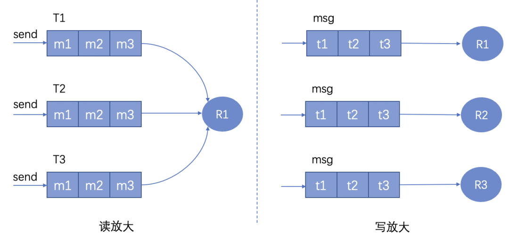

# 读写放大

目前的架构按照将用户根据userID等类型进行分类存储，由于每个用户在每条信息上的状态都不一样（**用户间信息特征具有唯一性**）。所以在下发的过程需经过`userID -> sessionID -> deviceID`的路线进行多次查询。如上文所说这是其中一个性能瓶颈，也就是所谓的**读放大**问题。

## 读放大

> **Q：严谨地解释一下读放大问题定义**
>
> A：读放大问题（Read Amplification）是指在数据库或存储系统中，为满足一个读请求而进行的**实际读取操作量远远超过了原始请求所需的数据量**。简单来说，就是**系统为了获取某一数据块，而不得不读取更多数据**，从而导致读操作的开销增大。

可以解决这个**读放大**问题吗？

## 写放大

可以，简单粗暴的一种思路是**将消息的状态结合消息本身一起存储**。但是这种做法也就意味着每个用户都需要**存储一份对自己可见的消息**，因为每个用户可见的消息都是不一样的。

也许有人会问**为什么不以消息的存储为中心，下发的时候再去查询**呢？因为这么干的话就回到原点成为读放大了...

但是这个思路首先对内存的压力是巨大的。在**写**的时候（**上行消息**），消息需要经过处理，这个处理可以是序列化，压缩等。**并且每当消息的状态发生改变，都需要将消息相关信息取出，修改后重新写入**。那么问题又来了，这种处理就形成了典型的**写放大问题**。

> **Q：严谨地解释一下写放大问题定义**
>
> A：写放大问题（Write Amplification）是指在数据库或存储系统中，为满足一个写请求而进行的**实际写入操作量远远超过了原始请求所需的写入数据量**。简单来说，就是**系统为了写入某一数据块，而不得不写入更多数据**，从而导致写操作的开销增大。

将上述的特点总结一下就是：

-   读放大：

    -   存储成本小（无冗余消息）
    -   存储效率高（无压缩等）
    -   存储一致性强（存储结构独立）
    -   写复杂度低，多次嵌套读。

-   写放大：

    -   存储成本高（用户为单位存储消息列表）
    -   维护一致性成本高（修改需先存再取，效率低）
    -   写复杂度高（压缩等操作），读复杂度低。

两种设计思路所对应的是两个极端。在IM中，我们可以根据不同会话的场景来设定不同的模式，结合两者的部分思考，**局部使用**。

对于绝大部分情境下（**单聊 &小群聊**）的IM，我们还是会采用**写放大**的模式。主要是在IM架构中，将消息有关属性入库本身可以设计为一个异步的过程（结合MQ），所以写相关的指标对比之下不大重要。而且读的效率会更高。但是会牺牲一部分内存。（人不多的情况下，缺点不凸显）

但是对于**大群聊 & 活跃群聊**来说，由于成员的基数大。若采用**读放大**模式，每一次的发送 / 下行消息都会引发大量**并发读，并发写**的请求。这其中虽然写这一过程本身是异步的，但是他还是消**费了大量的服务器CPU资源，从而影响整体的性能**。另一方面，让大群聊各成员都存储一份消息列表，本身就造成了不小的**空间负担**。因此**牺牲维护一致性的成本**，使用读放大模式，在**减轻写负载**的同时，也保证了服务器的稳定运行。也节省了存储空间就是了。

这只是针对大部分的常规情况而言，具体情况根据**IM具体的业务场景**作分析。并且如何界定 **单群 & 小群聊** or **大群聊 & 活跃群聊** ，也需要在测试之后，根据**服务器的性能**来权衡。更可以通过**每小时消息数**与**平均活跃时长**等标准。设置一个**活跃&非活跃群聊状态切换**的算法，更好服务各情景。