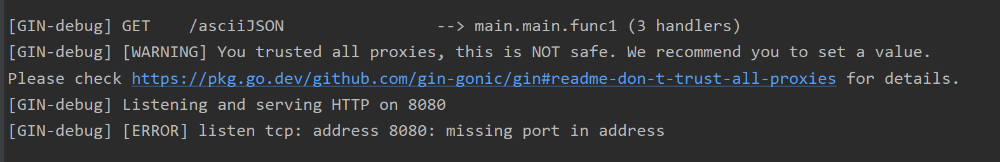

# Gin error question

记录在学习go web gin时遇到的错误与理解


## experience

最简单的例子

```go
type Login struct {
    User     string
    Password string
}


func main() {
    r := gin.Default()
    r.GET("/paramExm1", exm1)
}

func exm1(c *gin.Context) {
    var login Login
    err := c.ShouldBind(&login)
    
    if err == nil {
       fmt.Printf("login info: %#v\n", login)
       c.JSON(http.StatusOK, gin.H{
          "user":     login.User,
          "password": login.Password,
       })
    
    } else {
       c.JSON(http.StatusBadRequest, gin.H{"error": err.Error()})
    }
}
```

相当于**controller**层

**ShouldBind**方法类似于**springboot**中接受对象作为参数

就是将接收到的json请求信息 转化为**括号内结构体格式**

ifelse就是处理请求成功与否的关系了


### 数据库连接三格式

```go
	db, err := gorm.Open("mysql", "root:123456@/sql_test")
```

**直接粘贴栈溢出**

You might want to specify the protocol (like '`tcp`'), instead of `localhost` directly.
See [those examples](https://github.com/go-sql-driver/mysql#examples):

```java
user:password@tcp(localhost:5555)/dbname
```

In your case:

```java
username@tcp(localhost)/my_db
```

------

Note, if you use the default protocol (`tcp`) and host (`localhost:3306`), this could be rewritten as

```bash
user:password@/dbname
```


## error

### missing port in address



`gin.Default.Run()`内端口或网址有没写对

看看是不是漏了个 **:**

```go
r := gin.Default()
err := r.Run(":8080")
```


### missing go.sum entry for module providing package  < package name >


go.mod 中文件依赖的配置问题

可能是版本不兼容 或者多个第三方包引入依赖冲突 使用 `go mod tidy` 清除现有缓存并重新下载第三方包

虽然但是还是没用 StackOverflow里找到解法  `go mod tidy -e`


[go mod tidy详细说明]: https://go.dev/ref/mod#go-mod-tidy


`unable to access 'https://github.com/ivorysillegalss/mini-gpt.git/': Failed to connect to github.com port 443 after 21063 ms: Couldn't connect to server`

修改git配置：（其中的10809改为你电脑的端口号）

```bash
git config --global http.proxy http://127.0.0.1:10809
git config --global https.proxy http://127.0.0.1:10809
```

clash默认修改的端口号为7890


go项目启动失败

nohup: failed to run command '/home/go/main': Permission denied nohup: failed to run command '/home/go/main': Permission denied nohup: failed to run command '/home/go/main': Permission denied load config from file failed, 

文件权限不够 运行不了项目

```bash
chmod +x /home/go/main
```

使用以上命令来授权


err:open ./conf/config.ini: no such file or directory panic: 

找不到配置文件


运行时错误 数据库错误 redis错误 有可能是没读到配置文件 导致数据库初始化失败

runtime error: invalid memory address or nil pointer dereference [signal SIGSEGV: segmentation violation code=0x1 addr=0x0 pc=0x84e120] goroutine 1 [running]: mini-gpt/setting.initLog() D:/GoLand/GoProject/mini-gpt/setting/initialzation.go:41 +0x140 mini-gpt/setting.GetLogger(...) 

D:/GoLand/GoProject/mini-gpt/setting/initialzation.go:62 main.main() D:/GoLand/GoProject/mini-gpt/main.go:15 +0x34 time="2024-01-30T16:15:15+08:00" level=error msg="open ./logs/logfile.log: no such file or directory" time="2024-01-30T16:15:15+08:00" level=error msg="init database failed, err:%v\n"


回显主键

```go

type BotToStruct struct {
	BotId      int  `gorm:"primaryKey column:bot_id"` // 明确指定BotId为主键
	IsDelete   bool `gorm:"column:is_delete"`         // 导出字段，并可指定列名
	IsOfficial bool `gorm:"column:is_official"`       // 导出字段，并可指定列名
}

// 写入映射结构体对象中
func writeBotToStruct(isOfficial bool) *BotToStruct {
	return &BotToStruct{
		isDelete:   false,
		isOfficial: isOfficial,
	}
}

func CreateBot(isOfficial bool) (int, error) {
    botToStruct := writeBotToStruct(isOfficial)
//    获得一个botToStruct返回一个初始化后的
    if err := dao.DB.Table("bot").Create(botToStruct).Error; err != nil {
       return -1, err
    }
    return botToStruct.BotId, nil
}
```

gorm中 如果需要使用到回显主键的功能 通过create之后 会自动返回到传入的对象中 可以看到我上方并没有人为设置botId的值 下方直接get是能获取到的 但是上方获取不到 估计是gorm的bug

	ID         int  `gorm:"primaryKey column:bot_id"` // 明确指定BotId为主键

botToStruct中主键改成默认的主键名字ID就可以了


正确
```go
	var bot dto.UpdateBotDTO
	resultDTO := dto.ResultDTO{}
	if err := c.BindJSON(&bot); err != nil {
		// 检查参数解析是否出错
		c.JSON(http.StatusBadRequest, resultDTO.FailResp(constant.AdminModifyBotError, "管理员修改机器人失败", nil))
	}
	
```
错误
```go
	var bot *dto.UpdateBotDTO	
	resultDTO := dto.ResultDTO{}
	if err := c.BindJSON(bot); err != nil {
		// 检查参数解析是否出错
		c.JSON(http.StatusBadRequest, resultDTO.FailResp(constant.AdminModifyBotError, "管理员修改机器人失败", nil))
	}

```

BindJSON方法 相当于springboot的自动映射 将前端传过来的JSON数据映射为对应结构体

可以传递映射的**结构体实例或其指针**

在第一段代码中 首先声明了结构体的实例 再传递他的指针进行映射 （此时的指针已经分配好了内存空间） 是正确的做法

在第二段代码中 直接定义了对应结构体的指针 并且传递该指针 但是此指针并没有进行初始化(未分配空间) 值是nil 所以gin并不能将其绑定为对应的结构体类型

 在go语言中 所有的指针变量若未经初始化 他们的值都是nil 并不代表对应的 具体的数据类型

初始化之后 尽管都是结构体指针，但由于指向不同类型的结构体，不同结构体的指针类型是不同的。


```go
PS D:\GoLand\GoProject\mini-gpt> $env:GOOS="linux"
PS D:\GoLand\GoProject\mini-gpt> $env:GOARCH="amd64"
PS D:\GoLand\GoProject\mini-gpt> go build main.go  
```

Windows上编译linux文件
