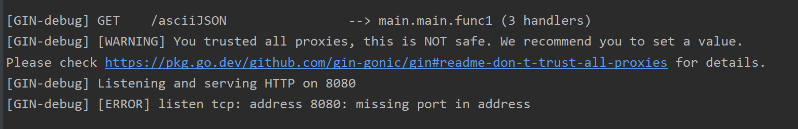

# Gin error question

记录在学习go web gin时遇到的错误与理解


### go-redis

```go
result, err := conn.Client.Do(conn.Ctx, "get", any1).Result()
```

```go
func (c *Client) Do(ctx context.Context, args ...interface{}) *Cmd {
    cmd := NewCmd(ctx, args...)
    _ = c.Process(ctx, cmd)
    return cmd
}
```

```go
type Cmd struct {
    baseCmd

    val interface{}
}
```

这里的val记录的是传过来的值和类型 baseCMD是基础命令

使用Result方法返回接口类型的值  和 baseCMD中错误


```go
type baseCmd struct {
    ctx    context.Context
    args   []interface{}
    err    error
    keyPos int8

    _readTimeout *time.Duration
}
```


### init

最简单的例子

```go
type Login struct {
    User     string
    Password string
}


func main() {
    r := gin.Default()
    r.GET("/paramExm1", exm1)
}

func exm1(c *gin.Context) {
    var login Login
    err := c.ShouldBind(&login)
    
    if err == nil {
       fmt.Printf("login info: %#v\n", login)
       c.JSON(http.StatusOK, gin.H{
          "user":     login.User,
          "password": login.Password,
       })
    
    } else {
       c.JSON(http.StatusBadRequest, gin.H{"error": err.Error()})
    }
}
```

相当于**controller**层

**ShouldBind**方法类似于**springboot**中接受对象作为参数

就是将接收到的json请求信息 转化为**括号内结构体格式**

ifelse就是处理请求成功与否的关系了


### 数据库连接三格式

```go
	db, err := gorm.Open("mysql", "root:123456@/sql_test")
```

**直接粘贴栈溢出**

You might want to specify the protocol (like '`tcp`'), instead of `localhost` directly.
See [those examples](https://github.com/go-sql-driver/mysql#examples):

```java
user:password@tcp(localhost:5555)/dbname
```

In your case:

```java
username@tcp(localhost)/my_db
```

------

Note, if you use the default protocol (`tcp`) and host (`localhost:3306`), this could be rewritten as

```bash
user:password@/dbname
```


### missing port in address



`gin.Default.Run()`内端口或网址有没写对

看看是不是漏了个 **:**

```go
r := gin.Default()
err := r.Run(":8080")
```


### missing go.sum entry for module providing package  < package name >


go.mod 中文件依赖的配置问题

可能是版本不兼容 或者多个第三方包引入依赖冲突 使用 `go mod tidy` 清除现有缓存并重新下载第三方包

虽然但是还是没用 StackOverflow里找到解法  `go mod tidy -e`


[go mod tidy详细说明]: https://go.dev/ref/mod#go-mod-tidy


### git push等操作失败

`unable to access 'https://github.com/ivorysillegalss/mini-gpt.git/': Failed to connect to github.com port 443 after 21063 ms: Couldn't connect to server`

修改git配置：（其中的10809改为你电脑的端口号）

```bash
git config --global http.proxy http://127.0.0.1:10809
git config --global https.proxy http://127.0.0.1:10809
```

clash默认修改的端口号为7890


### go项目启动失败 (权限)

nohup: failed to run command '/home/go/main': Permission denied nohup: failed to run command '/home/go/main': Permission denied nohup: failed to run command '/home/go/main': Permission denied load config from file failed, 

文件权限不够 运行不了项目

```bash
chmod +x /home/go/main
```

使用以上命令来授权


### err:open ./conf/config.ini: no such file or directory panic: 

找不到配置文件


### 运行时错误 数据库错误 redis错误 有可能是没读到配置文件 导致数据库初始化失败

runtime error: invalid memory address or nil pointer dereference [signal SIGSEGV: segmentation violation code=0x1 addr=0x0 pc=0x84e120] goroutine 1 [running]: mini-gpt/setting.initLog() D:/GoLand/GoProject/mini-gpt/setting/initialzation.go:41 +0x140 mini-gpt/setting.GetLogger(...) 

D:/GoLand/GoProject/mini-gpt/setting/initialzation.go:62 main.main() D:/GoLand/GoProject/mini-gpt/main.go:15 +0x34 time="2024-01-30T16:15:15+08:00" level=error msg="open ./logs/logfile.log: no such file or directory" time="2024-01-30T16:15:15+08:00" level=error msg="init database failed, err:%v\n"


### 回显主键

```go

type BotToStruct struct {
	BotId      int  `gorm:"primaryKey column:bot_id"` // 明确指定BotId为主键
	IsDelete   bool `gorm:"column:is_delete"`         // 导出字段，并可指定列名
	IsOfficial bool `gorm:"column:is_official"`       // 导出字段，并可指定列名
}

// 写入映射结构体对象中
func writeBotToStruct(isOfficial bool) *BotToStruct {
	return &BotToStruct{
		isDelete:   false,
		isOfficial: isOfficial,
	}
}

func CreateBot(isOfficial bool) (int, error) {
    botToStruct := writeBotToStruct(isOfficial)
//    获得一个botToStruct返回一个初始化后的
    if err := dao.DB.Table("bot").Create(botToStruct).Error; err != nil {
       return -1, err
    }
    return botToStruct.BotId, nil 
}
```

gorm中 如果需要使用到回显主键的功能 通过create之后 会自动返回到传入的对象中 可以看到我上方并没有人为设置botId的值 下方直接get是能获取到的 但是上方获取不到 估计是gorm的bug

	ID         int  `gorm:"primaryKey column:bot_id"` // 明确指定BotId为主键

botToStruct中主键改成默认的主键名字ID就可以了


**另**

Q：当使用save保存一个对象到对应的mysql数据库当中 而这个对象id字段放的是零值 若想回显主键 它会不会把零值作为id就直接赋值进数据库当中

A：在使用Go语言的GORM库进行数据库操作时，如果你在保存对象到MySQL数据库时使用了零值（例如，对于整型的`ID`字段，零值就是`0`）作为对象的`ID`，GORM的默认行为取决于你的`ID`字段是如何配置的。

**GORM利用`ID`字段来判断一个对象是否应该被插入为新记录还是更新现有记录。如果`ID`的值是其类型的零值（对于整数，这个值是`0`），GORM会将这个操作视为插入新记录。对于插入操作，如果`ID`字段被设置为自增（这是MySQL表中常见的配置），数据库会自动生成一个唯一的`ID`值，而不是使用提供的零值。**


### BindJSON和指针传递


正确
```go
	var bot dto.UpdateBotDTO
	resultDTO := dto.ResultDTO{}
	if err := c.BindJSON(&bot); err != nil {
		// 检查参数解析是否出错
		c.JSON(http.StatusBadRequest, resultDTO.FailResp(constant.AdminModifyBotError, "管理员修改机器人失败", nil))
	}
	
```
错误
```go
	var bot *dto.UpdateBotDTO	
	resultDTO := dto.ResultDTO{}
	if err := c.BindJSON(bot); err != nil {
		// 检查参数解析是否出错
		c.JSON(http.StatusBadRequest, resultDTO.FailResp(constant.AdminModifyBotError, "管理员修改机器人失败", nil))
	}

```

BindJSON方法 相当于springboot的自动映射 将前端传过来的JSON数据映射为对应结构体

可以传递映射的**结构体实例或其指针**

在第一段代码中 首先声明了结构体的实例 再传递他的指针进行映射 （此时的指针已经分配好了内存空间） 是正确的做法

在第二段代码中 直接定义了对应结构体的指针 并且传递该指针 但是此指针并没有进行初始化(未分配空间) 值是nil 所以gin并不能将其绑定为对应的结构体类型

 在go语言中 所有的指针变量若未经初始化 他们的值都是nil 并不代表对应的 具体的数据类型

初始化之后 尽管都是结构体指针，但由于指向不同类型的结构体，不同结构体的指针类型是不同的。


### Windows上编译linux的go可执行文件

```go
PS D:\GoLand\GoProject\mini-gpt> $env:GOOS="linux"
PS D:\GoLand\GoProject\mini-gpt> $env:GOARCH="amd64"
PS D:\GoLand\GoProject\mini-gpt> go build main.go
```


### 结构体嵌套 与 匿名结构体 映射等

先看代码及错误JSON

```go
type UpdateBotDTO struct {
    *models.Bot
}

type Bot struct {
	*BotInfo
	*BotConfig
	BotId int `gorm:"primaryKey"`
	//是否已经删除
	IsDelete bool
	//是否官方bot
	IsOfficial bool
}

type BotInfo struct {
	BotId       int    `json:"bot_id"`
	Name        string `json:"bot_name"`
	Avatar      string `json:"bot_avatar"`
	Description string `json:"bot_description"`
}

type BotConfig struct {
	BotId      int    `json:"bot_id"`
	InitPrompt string `json:"init_prompt"`
	Model      string `json:"model"`
}
```
原本是无脑按照嵌套嵌进JSON中的 但是这样子一直都是传的nil 及dto没有映射到真实值 错误json如下

```json
{
	"bot":{
            "bot_info": {
            "bot_name": "translate",
            "bot_avatar": "default",
            "bot_description": "a test"
        },
        "bot_config": {
            "init_prompt": "say lvoe plz",
            "model": "gpt-3.5-turbo-instruct"
        },
      "is_delete":false,
      "is_official":false,
      "bot_id":1
	}
}
```

但是go结构体中匿名嵌套结构体的特性有点类似于继承  如上 `updateBotDTO`结构体中只有一个 `Bot`的匿名字段 代表着在外部看来 这两个类是完全一样的 并且**没有嵌套关系** 
换句话说 完全可以使用 调用Bot方式字段中的方式来调用 updateBotDTO 中 
就如
```go
if updatedBot.IsOfficial {
		beforeBot, err := models.GetOfficialBot(updatedBot.BotId)
```
同时 也可以在 `updateBotDTO` 中把匿名对象搞出来 单独处理
```go
	bot := updatedBot.Bot
	isOfficial := bot.IsOfficial
```
两者效果是一样的
一句话总结就是 使用的时候 可以按照原本的嵌套关系进行调用 也可以直接调用匿名嵌套结构体中的字段

但是 **绑定字段 Bind前端JSON** 的时候只能后者 不可以进行显式嵌套 要么就在匿名对象后方加一个 `json:"bot"`等 但是这样使用匿名就没啥意义了 综上所述 正确的JSON调用只能是下方

```json
{
	"bot_name": "translate",
	"bot_avatar": "default",
	"bot_description": "a test",
	"init_prompt": "say lvoe plz",
	"model": "gpt-3.5-turbo-instruct",
	"is_delete": false,
	"is_official": false,
	"bot_id": 0
}
```


### 反射与嵌套匿名结构体

```go
//这里的反射代码其实可以用第三方structs类进行简化
//通过反射部分更新目标结构体
updateValue := reflect.ValueOf(bot).Elem()
//这个updateValue是需要部分更新的数据的元数据集 自己理解
dataValue := reflect.ValueOf(&beforeBot).Elem()
//Elem方法是获取到结构体字段或数组切片等数据结构底层字段值的方法
//于是这里先通过结构体的指针获取 其中指向的字段的值
```

```go
for i := 0; i < updateValue.NumField(); i++ {
    field := updateValue.Type().Field(i)

    fmt.Println(field)
    //类似java中的Field类型对象
    updateFieldValue := updateValue.Field(i)
    if updateFieldValue.IsZero() {
       continue
    }
    //如果是零值则跳过 不更新
    dataFieldValue := dataValue.FieldByName(field.Name)
    //通过属性的key获取返回的值
    if dataFieldValue.IsValid() && dataFieldValue.CanSet() {
       dataFieldValue.Set(updateFieldValue)
    }
}
```

数据结构同上一bug

此段代码是 **利用反射达成部分更新** 但是一直报 `err:interface *reflect.ValueError` 经检查是因为没有进行是否结构体的判断 只对普通的字段有效


### int等类型 & float64 json映射

当将json中的数据手动映射到map中 所有的整数或浮点数都会被识别成float64类型 需转换成float64之后再根据需求转回对应类型

```java
// 对于整数
if id, ok := data["id"].(float64); ok {
    intId := int(id)
    // 使用intId
}
```


### Type和Kind的区别

前者是得到变量的类型 可以获取指定的自定义结构体的类型

后者只能获得底层的基础类型 若是结构体则是`reflect.Struct` 指针则是`reflect.ptr`

`reflect.Type` 是类型的描述符，可以用于检查变量的类型。它是通过调用 `reflect.TypeOf()` 函数来获得的。`reflect.Kind` 是一个枚举类型，表示类型的底层基础类别，用于描述类型的分类，例如 `int`、`string`、`bool` 等。您可以通过 `reflect.ValueOf().Kind()` 方法来获取变量的底层类型。

`reflect.Type` 主要用于检查变量的类型，而 `reflect.Kind` 主要用于检查变量的底层基础类别。例如，`reflect.Type` 可以用于检查变量是否为 `int` 类型，而 `reflect.Kind` 可以用于检查变量是否为 `reflect.Int` 类型。

```go
package main

import (
    "fmt"
    "reflect"
)

func main() {
    var x int = 10
    var y string = "Hello"

    // 获取 x 的类型
    typeOfX := reflect.TypeOf(x)

    // 获取 x 的底层类型
    kindOfX := reflect.ValueOf(x).Kind()

    // 检查 x 的类型是否为 int
    if typeOfX == reflect.TypeOf(int(0)) {
        fmt.Println("x is of type int")
    }

    // 检查 x 的底层类型是否为 int
    if kindOfX == reflect.Int {
        fmt.Println("x is of kind int")
    }

    // 获取 y 的类型
    typeOfY := reflect.TypeOf(y)

    // 获取 y 的底层类型
    kindOfY := reflect.ValueOf(y).Kind()

    // 检查 y 的类型是否为 string
    if typeOfY == reflect.TypeOf("") {
        fmt.Println("y is of type string")
    }

    // 检查 y 的底层类型是否为 string
    if kindOfY == reflect.String {
        fmt.Println("y is of kind string")
    }
}
```


### gorm表连接查询错误

```go
	var records []*Record
if errors.Is(redis.Nil, err) {
    //redis中查不到的时候去mysql里查
    if err := dao.DB.Joins("JOIN chat_generation ON chat_ask.record_id = chat_generation.record_id").Where("chat_id = ?", chatId).
       Find(&records).Limit(10).Order("record asc").Error; err != nil {
       return ErrorRecord(), err
    }
```

此处的本意是在mysql中查询两个表中的内容，并将其合并存入records中，定位后是Find出的错

没法d 修改为原SQL语句 不报错

但是显示警告 `SQL dialect is not configured` GPT说是方言未确定与gorm的版本问题 暂且修改为下方代码

```go
err := dao.DB.Raw("SELECT * FROM chat_ask JOIN chat_generation ON chat_ask.record_id = chat_generation.record_id WHERE chat_ask.chat_id = ?", chatId).Scan(&records).Limit(10).Order("recordId asc").Error
if err != nil {
    // 处理错误
}
```


### for-range遍历自定义结构体 并赋值回原本中

这里的代码没有进行任何的优化 为一个n+1的查询 原代码

```go
err := dao.DB.Table("record_info").Where("chat_id = ?", chatId).Find(&records).Error
		for index, record := range records {
			err := dao.DB.Table("chat_ask").Where("record_id = ?", record.RecordId).First(record.ChatAsks).Error
			if err != nil {
				return ErrorRecord(), nil
			}
			err = dao.DB.Table("chat_generation").Where("record_id = ?", record.RecordId).First(record.ChatGenerations).Error
			if err != nil {
				return ErrorRecord(), nil
			}
		}
```

上面的代码有好几个问题

- 直接给record.赋值 			for range中的v是原元素的一个副本 直接对他进行修改没有任何的意义

- 结构体的指针未初始化

  > ### 确保结构体指针已初始化
  >
  > 在 GORM 中，当使用 `First` 或类似方法填充结构体时，目标变量必须是一个已经初始化的结构体指针。原始代码中没有明确显示这一点，可能导致在尝试填充未初始化的指针时出现错误。在我的修改中，我增加了以下检查和初始化操作：
  >
  > ```go
  > if records[index].ChatAsks == nil {
  >     records[index].ChatAsks = &ChatAsk{}
  > }
  > if records[index].ChatGenerations == nil {
  >     records[index].ChatGenerations = &ChatGeneration{}
  > }
  > ```
  >
  > 这两行代码检查 `ChatAsks` 和 `ChatGenerations` 是否为 `nil`（即未初始化）。如果是，就创建一个新的实例并赋予它们，这样 `First` 方法就有一个有效的目标来接收查询结果。

  修改为如下即可。

```go
func GetChatHistoryForChat(chatId int) (*[]*Record, error) {
    //返回一个存放record结构体的 指针的切片的 指针

    var records []*Record

    records, err := redisUtils.GetStruct[[]*Record](constant.ChatCache + strconv.Itoa(chatId))
    //去redis里查

    if errors.Is(redis.Nil, err) {
       err := dao.DB.Table("record_info").Where("chat_id = ?", chatId).Find(&records).Error
       if err != nil {
          return nil, err
       }
       for index, record := range records {
          // 确保 ChatAsks 和 ChatGenerations 是指向结构体的指针
          if records[index].ChatAsks == nil {
             records[index].ChatAsks = &ChatAsk{}
          }
          if records[index].ChatGenerations == nil {
             records[index].ChatGenerations = &ChatGeneration{}
          }

          err := dao.DB.Table("chat_ask").Where("record_id = ?", record.RecordId).First(records[index].ChatAsks).Error
          if err != nil {
             return ErrorRecord(), nil
          }
          err = dao.DB.Table("chat_generation").Where("record_id = ?", record.RecordId).First(records[index].ChatGenerations).Error
          if err != nil {
             return ErrorRecord(), nil
          }
       }

    } else if err != nil && !errors.Is(redis.Nil, err) {
       //出现了其他错误
       return ErrorRecord(), err
    }

    return &records, nil
}
```


### JAVA编码 GO解码JWT

本程序登录注册模块用java实现，用户登录之后，利用JWT生成token并存储在redis之中，而在chat等使用go写的模块中，需要用go来转码。

go get

```bash
go get github.com/dgrijalva/jwt-go
```

此处为例子的jwt中仅包含id信息

```java
    /**
     * 生成JWT令牌
     * @param claims JWT第二部分负载 payload 中存储的内容
     * @return 用户token
     */
    public static String createJwt(Map<String, Object> claims){
        return Jwts.builder()
                .addClaims(claims)
                .signWith(SignatureAlgorithm.HS256, SIGN_KEY.getBytes())
                .setExpiration(new Date(System.currentTimeMillis() + EXPIRE))
                .compact();
    }

    /**
     * 解析JWT令牌
     * @param jwt JWT令牌
     * @return claims内容的键值对
     * Key:  username 用户名
     *       userId  用户ID
     */
    public static Map<String,Object> parseJwt(String jwt){
        Claims claims = Jwts.parser()
                .setSigningKey(SIGN_KEY.getBytes())
                .parseClaimsJws(jwt)
                .getBody();
        return new HashMap<>(claims);
    }
}
```


**解析JWT并验证**

以下是一个Go的示例函数，演示如何解析JWT令牌提取claims：

```go
package main

import (
	"fmt"
	jwt "github.com/dgrijalva/jwt-go"
	"strconv"
)

var mySigningKey = []byte("SomersaultCloud")

//var mySigningKey = "SomersaultCloud"

// 解析JWT
func parseJWT(tokenString string) (*jwt.Token, error) {
	// 解析并验证JWT。注意：确保提供一个key function来验证签名算法
	token, err := jwt.Parse(tokenString, verifySignature)
	if err != nil {
		return nil, err
	}

	return token, nil
}

func verifySignature(token *jwt.Token) (interface{}, error) {
	// 确保token的签名算法是我们期望的
	if _, ok := token.Method.(*jwt.SigningMethodHMAC); !ok {
		return nil, fmt.Errorf("Unexpected signing method: %v", token.Header["alg"])
	}
	return mySigningKey, nil
}
```


此处使用的是jwt包中的Parse方法 从它的源码中可以发现，其实是调用了`ParseWithClaims`，并以一个Map作为映射的Claims参数

一般情况下，用户也可以自己调用`ParseWithClaims`，并自己规定数据返回的格式。此时需要自己定义一个Claims作为映射的形参。

```go
func Parse(tokenString string, keyFunc Keyfunc) (*Token, error) {
    return new(Parser).Parse(tokenString, keyFunc)
}

func (p *Parser) Parse(tokenString string, keyFunc Keyfunc) (*Token, error) {
	return p.ParseWithClaims(tokenString, MapClaims{}, keyFunc)
}

func (p *Parser) ParseWithClaims(tokenString string, claims Claims, keyFunc Keyfunc) (*Token, error) 
```

而这个Claims其实就是token中数据映射的模板，需要自定义解码后数据的格式，可以设计如下：

```go
type Claims struct {
    ID int `json:"uid"`
    jwt.StandardClaims
}

type StandardClaims struct {
	Audience  string `json:"aud,omitempty"`
	ExpiresAt int64  `json:"exp,omitempty"`
	Id        string `json:"jti,omitempty"`
	IssuedAt  int64  `json:"iat,omitempty"`
	Issuer    string `json:"iss,omitempty"`
	NotBefore int64  `json:"nbf,omitempty"`
	Subject   string `json:"sub,omitempty"`
}
```

继承`jwt.StandardClaims`，其中包含的是过期时间等一类的的信息。


在成功转码token之后，我们需要提取其中所包含的信息

```go

func DecodeToId(tokenString string) (int, error) {
	token, err := parseJWT(tokenString)
	if err != nil {
		fmt.Println("Error parsing token:", err)
		return 0, err
	}

	if claims, ok := token.Claims.(jwt.MapClaims); ok && token.Valid {
		// 可以直接访问claims里的信息，例如用户ID
		if uidStr, ok := claims["uid"].(string); ok {
			uid, err := strconv.Atoi(uidStr)
			if err != nil {
				return 0, err
			}
			return uid, nil
		}
	} else {
		fmt.Println("Invalid token")
	}
	return 0, err
}
```


**但是需要注意，java中的数字签名必须是 字节数组！！！ 不可以是字符串**

```java
    public static String createJwt(Map<String, Object> claims){
        return Jwts.builder()
                .addClaims(claims)
                // .signWith(SignatureAlgorithm.HS256, SIGN_KEY.getBytes())
            	.signWith(SignatureAlgorithm.HS256, SIGN_KEY)
                .setExpiration(new Date(System.currentTimeMillis() + EXPIRE))
                .compact();
    }
```

如上，虽然直接以以字符串为签名生成token没有问题，但是解码的时候，**go-jwt中不支持验证字符串**。

在go-jwt中，起到验证数字签名方法的形参是`keyFunc`的返回值，go-jwt通过它的返回值来进行判断，虽然它返回的类型是一个`interface{}`，但并不支持字符串

如上的错误操作会出现两种问题

1. 直接使用字符串作为数字签名

```go
var mySigningKey = "SomersaultCloud"

func verifySignature(token *jwt.Token) (interface{}, error) {
	// 确保token的签名算法是我们期望的
	if _, ok := token.Method.(*jwt.SigningMethodHMAC); !ok {
		return nil, fmt.Errorf("Unexpected signing method: %v", token.Header["alg"])
	}
	return mySigningKey, nil
}
```


单步调试的时候，可以看到err中的错误信息是`key is of invalid type`，（不是符合要求的类型）


2. 将字符串改为字节数组后作为数字签名

```go
var mySigningKey = []byte("SomersaultCloud")

func verifySignature(token *jwt.Token) (interface{}, error) {
	// 确保token的签名算法是我们期望的
	if _, ok := token.Method.(*jwt.SigningMethodHMAC); !ok {
		return nil, fmt.Errorf("Unexpected signing method: %v", token.Header["alg"])
	}
	return mySigningKey, nil
}
```


这种情况下，token原数字签名仅是字符串，此处将其字节流之后以原来不同，于是报错（数字签名错误）


### 空channel相关

现在有二个板块的代码

```go
var	dataReadyStreams = make(map[int]chan bool)
	for {
		select {
		case v := <-dataReadyStreams[userId]:
			if v {
				// 当 v 为 true 时，执行操作
				log.GetTextLogger().Info("Data is ready, proceeding...")
				data, exists := streams[userId]
				//if !exists || data == nil {
				if !exists {
					log.GetTextLogger().Error("error for get stream data,channel is empty for user " + strconv.Itoa(userId))
					return nil, nil
				}
				return data.sequenceValue, data.activeChan
			} else {
				// 如果 v 为 false，则阻塞继续等待
				log.GetTextLogger().Warn("Data not ready, waiting...")
			}
		}
		// 阻塞1秒后继续循环检查
		time.Sleep(time.Second)
	}
```

这里的dataReadyStreas是一个map  通过它来记录每一个map中流是否就绪 可以获取值

本意是当这里的nil通道 一旦成功获取到值 就会将这个值渲染并下发

赋值的代码是 （**在另外一个goroutine中执行**）

```go
			if dataReadyStreams[identity] == nil {
				dataReadyStreams[identity] = make(chan bool, 1)
			}
```

整个流程即是 主goroutine试图从空channel中获取值 这个channel由另外一个goroutine赋值

但是这样是**不合法的**

一旦select语句中 （不只是select语句 此处泛指任何情况） 试图从nil的channel中获取数据

那么就会**永久阻塞住**

解决方法就可以在select语句中加default分支 或者在接受的时候 做一个判断并提前为其赋值


如果有default语句 并且某个channel为空 就会忽略到这个channel并不执行。

